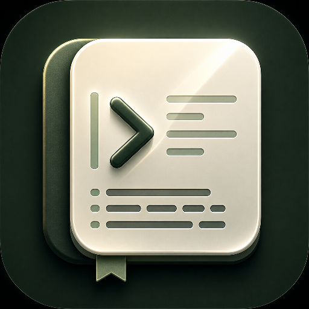

# LocalMD Reader

<p align="center">
  
</p>

<p align="center">
  広告、トラッキング、ネットワークアクセスなしで読む軽量 Android Markdown ビューア。
</p>

LocalMD Reader は、軽量な Android 向け Markdown ビューアです。

LocalMD Reader は現在 Google Play テストとリリース準備中です。

クローズドテスト参加リンク:

- Web: https://play.google.com/apps/testing/io.github.yosk.mdlite
- Android: https://play.google.com/store/apps/details?id=io.github.yosk.mdlite

ローカル Markdown ファイルをすばやく読むことを目的とし、広告、トラッキング、
ログイン、同期、ネットワークアクセスを前提にしません。

## 機能

- `.md` と `.markdown` ファイルを開く
- Android のファイルマネージャから Markdown ファイルを開く
- 他アプリから共有された Markdown ファイルを開く
- Termux から `mdlite-reader` で Markdown ファイルを開く
- クリップボードのテキストから一時的な Markdown 文書を作成する
- 一時的な Markdown 文書を `名前を付けて保存` で保存する
- ローカルで Markdown をレンダリングし、制限した WebView で表示する
- ライトテーマとダークテーマ
- ピンチ操作によるフォントサイズ変更
- 最近開いたファイル、最大 5 件
- 最近開いたファイルの履歴クリア
- 複数タブ
- 前回開いていたタブの復元
- 操作部品を上部または下部へ移動
- `INTERNET` 権限なし

## 対応 Markdown

LocalMD Reader v0.1.0 では、小さな Markdown サブセットを意図的に実装しています。

対応:

- 見出し
- 段落
- 箇条書き
- 番号付きリスト
- チェックリスト
- 引用
- フェンス付きコードブロック
- インラインコード
- HTTP / HTTPS リンク
- テーブル
- 水平線
- 生 HTML のエスケープ
- 対応言語のコードハイライト
- 基本的な Mermaid 図のローカル表示

v0.1.0 では非対応:

- Markdown 編集
- 完全な CommonMark 互換
- Mermaid の高度な操作
- 数式
- 脚注
- リモート画像読み込み
- 相対画像表示
- クラウド同期

Free ビルドは、高速なローカル Markdown 閲覧、コードハイライト、基本的な Mermaid 図、
タブ、クリップボードから作成した一時文書、最近開いたファイル、プライバシーを保った
オフライン利用に集中します。Pro専用機能は Free ビルドでは無効です。

## 使い方

詳しくは [docs/guides/usage.ja.md](docs/guides/usage.ja.md) を参照してください。

Termux コマンドの詳細は [docs/guides/termux-command.ja.md](docs/guides/termux-command.ja.md) にあります。

## プライバシー

LocalMD Reader は個人情報を収集しません。

アプリはユーザーが選択したファイルだけを読み取ります。Markdown 本文は端末上で
レンダリングされ、アプリによってアップロードされません。

詳しくは [PRIVACY.ja.md](PRIVACY.ja.md) を参照してください。

## セキュリティ

初期版ではネットワーク権限を要求せず、表示用 WebView の JavaScript も無効にします。

詳しくは [SECURITY.ja.md](SECURITY.ja.md) を参照してください。

## ビルド

現在は Termux 上の軽量 Android SDK 環境でビルドします。

```sh
cd ~/AndroidDev
. ./env.sh
cd projects/localmd-reader
./build.sh
```

このリポジトリでは、通常ビルドとリリースビルド時に `env.project.sh` を読み込み、
このアプリ用の Android platform / build-tools バージョンを固定します。

生成される debug APK:

```text
app-debug.apk
```

## テスト

```sh
./test.sh
```

テストスクリプトは JVM ユニットテスト、debug APK ビルド、署名検証、
`INTERNET` 権限が含まれていないことの確認を行います。

## リリース署名

本番署名にはリポジトリ外の keystore を使います。
Play Store アップロード用ビルドでは署名済み Android App Bundle を使います。

詳しくは [docs/release/release-signing.ja.md](docs/release/release-signing.ja.md) を参照してください。

## リポジトリ状態

このリポジトリはクローズドテストとリリース準備のために public にします。

クローズドテストのメモは [docs/release/closed-testing-guide.ja.md](docs/release/closed-testing-guide.ja.md)
にあります。テスター募集文は
[play-store/testing/closed-test-invitation.ja.txt](play-store/testing/closed-test-invitation.ja.txt)
にあります。

## ライセンス

Apache License 2.0 です。[LICENSE](LICENSE) を参照してください。
