# Documentation Guide

Product, domain, release, and agent-operation documents, organized into
subdirectories by purpose. Read from high-level policy toward implementation
detail. Many docs have a Japanese mirror (`*.ja.md`).

```mermaid
flowchart TD
    Guide["docs/README.md"] --> Domain["domain/"]
    Guide --> Harness["harness/"]
    Guide --> Product["product/"]
    Guide --> Release["release/"]
    Guide --> Guides["guides/"]

    Domain --> Glossary["domain-glossary.md (hub)<br/>+ 6 cluster files"]
    Domain --> DocTodo["documentation-domain-knowledge-todo.md"]

    Harness --> AgentHarness["agent-harness-design.md"]
    Harness --> TestStrategy["test-strategy.md"]
    Harness --> CICD["github-actions-cicd.md"]
    Harness --> ClaudeTodo["claude-harness-engineering-todo.md → backlog"]

    Product --> FreePro["free-pro-feature-policy.md"]
    Product --> Arch["architecture-package-policy.md"]
    Product --> Billing["play-billing-design.md"]
    Product --> ProContext["pro-development-context.md (historical)"]

    Release --> Runbook["production-release-runbook.md"]
    Release --> Play["play-console-submission / play-store-*"]
    Release --> Notes["release-notes-v*.md"]

    Guides --> Usage["usage.md / debug-installation.md / termux-command.md"]
```

## domain/ — ubiquitous language

- [`domain/domain-glossary.md`](./domain/domain-glossary.md): canonical hub (entitlement cluster + how to read).
- Cluster files: [`viewer`](./domain/domain-glossary-viewer.md), [`navigation`](./domain/domain-glossary-navigation.md),
  [`rendering`](./domain/domain-glossary-rendering.md), [`appearance`](./domain/domain-glossary-appearance.md),
  [`purchase`](./domain/domain-glossary-purchase.md), [`gestures`](./domain/domain-glossary-gestures.md).
- [`domain/documentation-domain-knowledge-todo.md`](./domain/documentation-domain-knowledge-todo.md): rules-as-decisions TODO.
- [`adr/README.md`](./adr/README.md): architecture decisions, alternatives, rationale, and reconsideration triggers.

## harness/ — CI, tests, and agent operation

- [`harness/agent-harness-design.md`](./harness/agent-harness-design.md): harness design areas and acceptance criteria.
- [`harness/adr-governance.md`](./harness/adr-governance.md): ADR review workflow and blocking commit gate.
- [`harness/test-strategy.md`](./harness/test-strategy.md): test sizes/scopes, pyramid, CI cadence, Robolectric decision.
- [`harness/github-actions-cicd.md`](./harness/github-actions-cicd.md): CI/CD architecture, artifacts, release workflow.
- [`harness/claude-harness-engineering-todo.md`](./harness/claude-harness-engineering-todo.md) →
  [`backlog`](./harness/claude-harness-engineering-backlog.md): harness work items.

## product/ — feature policy and design

- [`product/free-pro-feature-policy.md`](./product/free-pro-feature-policy.md): Free/Pro boundary (current source of truth).
- [`product/architecture-package-policy.md`](./product/architecture-package-policy.md): package and layering rules.
- [`product/play-billing-design.md`](./product/play-billing-design.md): Pro billing design.
- [`product/markdown-parser-migration-criteria.md`](./product/markdown-parser-migration-criteria.md): parser migration criteria.
- [`product/pro-development-context.md`](./product/pro-development-context.md): **historical snapshot** (not the current roadmap).

## release/ — release and Play operations

- [`release/production-release-runbook.md`](./release/production-release-runbook.md),
  [`release/release-signing.md`](./release/release-signing.md),
  [`release/versioning.md`](./release/versioning.md),
  [`release/closed-testing-guide.md`](./release/closed-testing-guide.md).
- Play Store: [`play-console-submission`](./release/play-console-submission.md),
  [`play-developer-api`](./release/play-developer-api.md),
  [`play-store-listing`](./release/play-store-listing.md),
  [`play-store-data-safety`](./release/play-store-data-safety.md),
  [`play-store-screenshots`](./release/play-store-screenshots.md).
- Release notes: [`release/release-notes-v0.1.0.md`](./release/release-notes-v0.1.0.md)
  (validated by `scripts/check-release-notes.sh`).

## guides/ — using and developing the app

- [`guides/usage.md`](./guides/usage.md), [`guides/debug-installation.md`](./guides/debug-installation.md),
  [`guides/termux-command.md`](./guides/termux-command.md), [`guides/icon-design-note.md`](./guides/icon-design-note.md).

## Read First

- [`../AGENTS.md`](../AGENTS.md): repository-wide engineering rules for human and AI contributors.
- [`product/free-pro-feature-policy.md`](./product/free-pro-feature-policy.md) — what Free vs Pro means.
- [`domain/domain-glossary.md`](./domain/domain-glossary.md) — domain vocabulary and rules.
- [`harness/test-strategy.md`](./harness/test-strategy.md) — how the project tests.

## Maintenance Rules

- Keep each Markdown file under 300 lines.
- Prefer diagrams for relationships and workflows.
- Keep canonical rules in policy or glossary documents, not in transient TODOs.
- Do not write secrets, private keys, service-account JSON, or personal data.
- When a TODO grows, split stable background into a backlog or design document.
- Place a new doc in the subdirectory that matches its purpose, and link it here.
