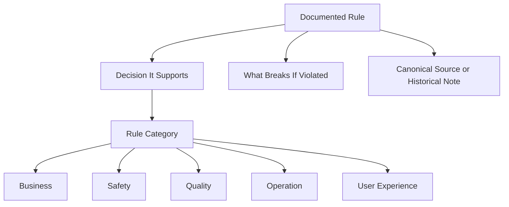

# Domain Knowledge Documentation TODO

## Goal

Treat domain knowledge and specifications as the rule set that preserves
business, safety, quality, and operational decisions. Documentation should make
future decisions reproducible, not merely describe implementation details.

## Current TODO

1. (DONE) Add a lightweight category label to rule-bearing glossary entries.
   Every L2 rule across the glossary clusters now carries `分類:`
   (`business` / `safety` / `quality` / `operation` / `UX`). The hub defines the
   five categories near its "なぜ" policy note.
2. (DONE) For each L2 rule, state which decision the rule supports. Each L2 rule
   now has `支える判断:` (the decision it protects).
3. (DONE) For each policy document, make clear whether it is current or
   historical. `free-pro-feature-policy*`, `architecture-package-policy`,
   `play-billing-design*` carry a current-source banner; `pro-development-context*`
   is marked historical.
4. (DONE) Keep implementation details out of domain rules. Rules state the
   decision (`なぜ` / `支える判断`); the implementation appears only as the
   enforcement point (`どこで`), which is the allowed single-place exception.
5. (DONE) "What breaks if this rule changes" is present as `破ると:` on every L2
   rule.

### Follow-up (optional)

- Extend `分類:` to notable L1 invariants where the category is non-obvious
  (currently L2 only).
- Add current/historical banners to remaining minor policy/criteria docs as they
  are touched.

## Classification Guide

- `business`: pricing, Free/Pro boundaries, purchase value, public repository policy.
- `safety`: privacy, offline guarantees, permission limits, fail-closed behavior.
- `quality`: TDD, test-smell rules, file-size limits, architecture constraints.
- `operation`: Play Console, CI/CD, release, signing, branch protection.
- `UX`: user-visible behavior that affects reading comfort or workflow speed.

## Acceptance Criteria

- A reader can tell why a rule exists before reading implementation code.
- A rule-bearing document states what kind of decision it protects.
- Historical context is not mistaken for current product state.
- No document grows beyond the 300-line limit.
- No secrets, private identifiers, or personal data are introduced.
