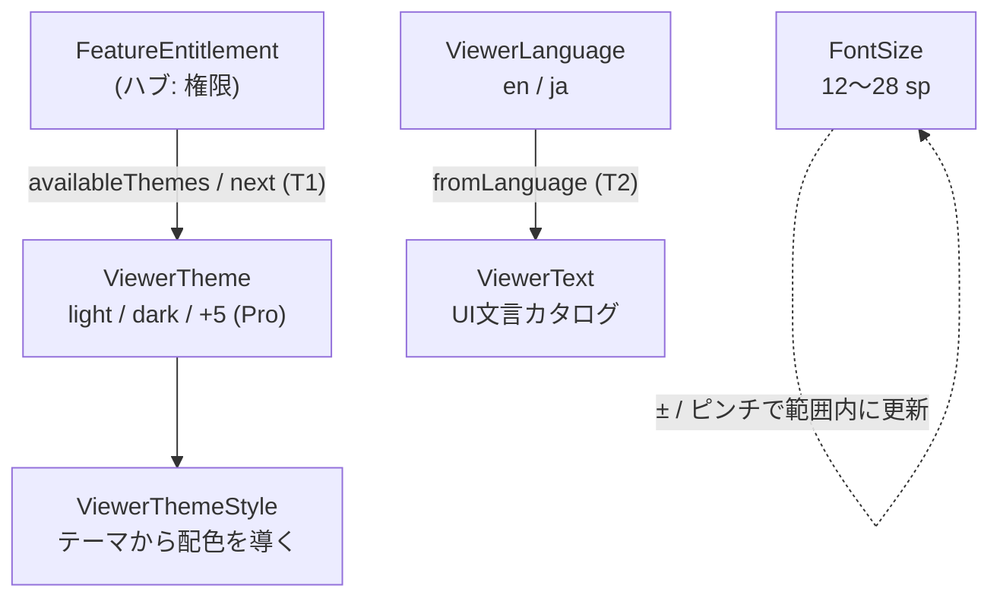

# ドメイン用語集: 外観・言語

## このドキュメントの目的

見た目と言語の中核用語——テーマ・配色・文字サイズ・UI言語・UI文言——を、**構成要素・L1（語が単独で守る規則）・
L2（語と語の間の規則）・L3（動作の規則）**で記す。設定メニュー（テーマ切替・文字サイズ・言語切替）が表出する
ドメイン概念はここに対応する（メニュー/ボタン自体は presentation 層で対象外）。

操作コントロールの配置 `ControlsPlacement` はビューアクラスタ [`domain-glossary-viewer.md`](./domain-glossary-viewer.md) を参照。
記法・3階層モデル・「なぜ」の方針はハブ [`domain-glossary.md`](./domain-glossary.md) を参照。

---

## 全体像: 権限・言語から外観を決める

**読み方**: 権限が使えるテーマの範囲（`availableThemes`）と切替の巡回（`next`）を決める（Free は light/dark、
Pro は全7種）。テーマから `ViewerThemeStyle` が具体的な配色を導く。UI言語 `ViewerLanguage` から `ViewerText`
が表示文言を導く。`FontSize` は 12〜28 sp の範囲内で増減・ピンチ更新される。

---

## 語の定義（構成要素 と L1）

- **ViewerTheme**（`viewer/ViewerTheme.java`）: 配色テーマ。構成要素 `value: {light, dark, amoled, gradient, aurora, mist, dusk}`（7種）。
  - L1: `fromStoredValue(value)` は未知値を `light` に倒す（安全既定）。照合は厳密一致（大文字・空白付きも未知値扱い）。
    なぜ: 壊れた/将来の未知の保存値でもクラッシュせず既定テーマで表示する（fail-closed）。
  - L1: `storedValue()` → `fromStoredValue()` の往復は同一テーマに戻る（全7種。`ViewerThemeTest.storedValueRoundTripsForEveryTheme`）。
    なぜ: 保存・復元でユーザーのテーマ選択を失わない。
  - 操作 `toggled()`（light↔dark）/`next(entitlement)`/`availableThemes(entitlement)`/`storedValue()`/`isDark()` 他。 規則→T1。
- **ViewerThemeStyle**（`viewer/ViewerThemeStyle.java`）: テーマの具体的な配色。構成要素は背景・面・文字・コード・図などの色トークン群と、
  強調色の上に置く文字色 `onPrimary`（アクティブタブ・主要アクションの文字）。操作 `from(ViewerTheme)`。 規則→T3。
  - L1: `from(null)` は light の配色に倒す（例外を投げない）。 なぜ: テーマ不明でも配色導出を全域にする（fail-closed）。
  - L1: `hasDarkBackground()` は背景の輝度が本文文字の輝度より低いとき真（システムバーのアイコン明暗の根拠）。
    なぜ: dark/amoled の列挙（`ViewerTheme.isDark()`）に頼ると aurora のような「暗い背景だが dark 系でない」テーマで判定漏れする。
    輝度で判定すれば将来のテーマにも自動で正しく働く。
- **FontSize**（`viewer/FontSize.java`）: 文字サイズ（sp）。構成要素 `sp: int`（`MIN_SP=12` / `MAX_SP=28` / `DEFAULT_SP=16`）。
  - L1: `of(sp)` は範囲 12〜28 を強制（範囲外は例外）。 なぜ: 読めないほど小さい/大きいサイズを構築不能にする（AlwaysValid）。
  - 操作 `defaultSize()`/`of(sp)`/`increased()`/`decreased()`/`changedByPinchScale(scale)`/`sp()`。 規則→F1。
- **ViewerLanguage**（`viewer/ViewerLanguage.java`）: UI言語。構成要素 `storedValue: {en, ja}`。
  - L1: `fromStoredValue(value)` は `ja` なら日本語、それ以外（未知・null含む）は英語に倒す。 なぜ: 未知値でも既定（英語）で壊さない（fail-closed）。
  - 操作 `english()`/`japanese()`/`toggled()`/`isJapanese()`/`storedValue()`。
- **ViewerText**（`viewer/ViewerText.java`）: UI文言カタログ（英語/日本語の実装）。操作 `fromLanguage(ViewerLanguage)` と各文言メソッド（`openFile()` 等）。 規則→T2。

---

## L2: 語と語の間で守るルール

**T1: 使えるテーマと切替の巡回は権限から導く**
- 関係する語: FeatureEntitlement → ViewerTheme ／ どこで: `ViewerTheme.availableThemes` / `next`（`EXTRA_THEMES` を許すか）
- 分類: business ／ 支える判断: 追加テーマを Pro 価値にし、Free は light/dark を完整提供する判断。
- なぜ: 追加テーマ（amoled 他5種）は Pro 価値。Free は light/dark を完整に提供する（ハブの「権限が機能を許可するか」を外観に反映）。
- Pro 追加テーマは、単なる light/dark の微差ではなく用途差を持つ。例: modern gradient、dark aurora、AMOLED、
  high-contrast ink、sepia long-form reading。
- 破ると: 無料で追加テーマが使える／Pro なのに light/dark しか出ない。Free: `{light, dark}`、Pro: 全7種。

**T2: UI文言は言語から導出する（独立に持たない）**
- 関係する語: ViewerLanguage → ViewerText ／ どこで: `ViewerText.fromLanguage(language)`
- 分類: UX ／ 支える判断: 文言を言語に一元化する判断（i18n）。
- なぜ: 文言を言語に一元化する。各所に文字列を散らすと言語と表示が食い違う。
- 破ると: 言語設定と画面の文言がずれる。
- Pro機能カタログのような構造化文言も、選択中の`ViewerText`が全項目を同一言語で供給する。
  外枠だけを翻訳し、項目説明を別の固定カタログから取得してはならない（ADR-0018）。

**T3: どのテーマでも文字は背景に対して読める（WCAG AA コントラスト 4.5:1 以上）**
- 関係する語: ViewerTheme → ViewerThemeStyle の色トークン対（文字×背景、`onPrimary`×`primary` 等） ／
  どこで: 値は `ViewerThemeStyle` の各テーマ定義、検証は `ViewerThemeContrastTest`（適応度テスト）
- 分類: UX（アクセシビリティ） ／ 支える判断: 配色をデザイン感覚でなく数値基準（WCAG AA = コントラスト比 4.5:1）で守る判断。
- なぜ: 明るい強調色に白文字を重ねる等の「もっともらしいが読めない」配色は目視レビューをすり抜ける（実例: 修正前のアクティブタブは
  dark 系3テーマで 1.59〜2.54:1 だった）。テーマ追加時も自動で検査される。
- 破ると: ダーク系テーマでアクティブタブや主要ボタンの文字が読めない。

**F1: 文字サイズは常に 12〜28 sp に収まる**
- 関係する語: FontSize（単独だが全操作で保つ不変条件） ／ どこで: `of`（例外）と各操作（クランプ）
- 分類: UX ／ 支える判断: 読める範囲に文字サイズを収める判断。
- なぜ: 読める範囲を超えないようにする。
- 破ると: 極端なサイズで読めない/レイアウト破綻。

---

## L3: 動作が守るルール（L1 を保ち L2 を実現する）

- `ViewerTheme.next(e)` / `availableThemes(e)`: T1 を実現。`EXTRA_THEMES` を許さなければ Free は `toggled()`（light↔dark）、
  許せば 7種を巡回・全列挙。`e == null` は Free 扱い。 なぜ: 権限で選択肢を絞り、不明時は安全側 Free（fail-closed）。
- `ViewerSettingsStore.loadViewerTheme()`（presentation の永続化境界）: T1 を**読み込み時にも**実現。Free 権限で保存値が
  Pro 専用テーマなら light に倒す（dark のみ維持）。なぜ: `fromStoredValue` 自体は権限を見ないため、Pro 失効後に保存済み
  Pro テーマがそのまま復元されると T1 が破れる。境界で絞る（検証: `ViewerSettingsStoreMediumTest.freeEntitlementDoesNotRestoreProOnlyTheme`）。
- `MainActivity.reloadFeatureEntitlement()`（presentation の権限更新境界）: T1 を**実行中の画面状態にも**実現。権限の再読み込みで
  Pro 専用テーマが許可されなくなった場合は、現在の表示テーマを light に倒して画面反映する（dark のみ維持）。
  なぜ: 起動後の購入状態更新で Free に戻ったとき、保存境界だけで絞っても、すでに表示中の Pro テーマが次回起動まで残る。
  権限更新境界でも同じドメイン規則を適用する。自動クランプでは保存値を上書きしない。なぜ: 一時的な課金確認失敗で
  Pro ユーザーの保存済みテーマ選択を失わないため。形式モデル `models/appearance-theme.als` の `T1HoldsThroughoutSession` で、
  セッション中の権限更新後も T1 の反例がないことを検査する。
- `ViewerTheme.toggled()`: dark 系（dark/amoled）→ light、それ以外（light と Pro 系4種）→ dark。判定は輝度でなく列挙
  `isDark()` に依るため、暗い背景の aurora からも dark へ向かう。production では `next()` 経由でのみ呼ばれ、Free は
  読み込み境界で light/dark に絞られるため、通常の実行経路では light↔dark の往復になる（Pro 系からの挙動は防御的）。
  なぜこの向きか: 設計意図の文書は無く、実装からの記載（探索セッション 2026-06-06 で観測）。
- `FontSize.increased()` / `decreased()` / `changedByPinchScale(scale)`: F1 を保つ。境界では据え置き、ピンチは
  正の有限 scale だけ `round(sp × scale)` を 12〜28 にクランプする。非有限・非正の scale（NaN/∞/0/負）は現在値を維持する。
  なぜ: ジェスチャー検出器から異常値が来ても読める文字サイズを最小/最大へ collapse させない。操作経由では例外を出さず、
  常に範囲内の有効値を返す（全域性）。
- `FontSize.canApplyPinchScale(scale)`: ピンチ継続中の累積 scale に混ぜてよい値は正の有限 scale だけにする。
  なぜ: 異常な一時 scale を累積値へ混ぜると、その後の正常値でも操作前後の対応が壊れる。呼び出し側は異常値を無視し、
  直前までの有効な表示サイズとズームを保つ。
- `ViewerText.fromLanguage(language)`: T2 を実現。言語に対応する文言実装を返す。 なぜ: 表示文言を言語と常に同期させる。

**永続化の境界（注記・探索2026-06-13 appearance×viewer 監査）**: テーマ（外観）は **viewer 設定と同じ SharedPreferences ファイル `viewer_settings`**（キー `viewer_theme`）に保存される。appearance と viewer はこのファイルを共有するが、**書き込むのは `ViewerSettingsStore` ただ一つ**で、ファイル内のキー（`viewer_theme` / `viewer_language` / `controls_placement` / `*_shortcut` 等）はすべて相異なる。`ViewerSettingsStore` に一括 `clear()` は無く、`remove()` はカスタムジェスチャ2キーに限定。
なぜ問題ないか: prefs ファイルごとに**書き手が一意**なので、調整されないキー衝突が起きない。テーマが viewer 設定に同居しても、テーマだけを意図せず消す経路は存在しない（探索 2026-06-13: appearance×viewer の SharedPreferences 共有を静的監査し、衝突ゼロを確認）。

---

## 関連

- 記法・「なぜ」の方針（ハブ）・権限クラスタ: [`domain-glossary.md`](./domain-glossary.md)
- T1 と巡回・読み込み境界の検査可能な形式化（Alloy）: [`models/appearance-theme.als`](./models/appearance-theme.als)
  （実行: `sh scripts/check-domain-model.sh`。仕様変更時に再実行して既存保証の破れを反例で検出する）
- 操作コントロールの配置 `ControlsPlacement`: [`domain-glossary-viewer.md`](./domain-glossary-viewer.md)
