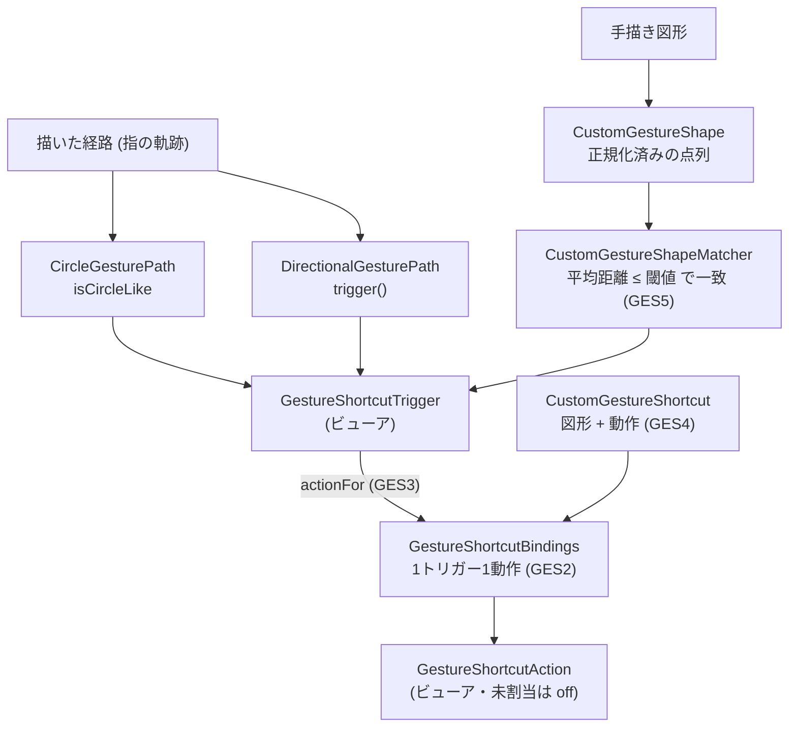

# ドメイン用語集: ジェスチャ詳細

## このドキュメントの目的

ジェスチャの認識と割り当ての中核用語——円・方向の経路認識、カスタム図形、トリガーから動作への割り当て——を、
**構成要素・L1（語が単独で守る規則）・L2（語と語の間の規則）・L3（動作の規則）**で記す。

基本の「トリガー→動作」の組 `GestureShortcutBinding` と、トリガー `GestureShortcutTrigger`・動作
`GestureShortcutAction` はビューアクラスタ [`domain-glossary-viewer.md`](./domain-glossary-viewer.md) を参照。
カスタムジェスチャは Pro 機能（`CUSTOM_GESTURE_SHORTCUTS`。ハブの「権限が機能を許可するか」を参照）。
記法・「なぜ」の方針はハブ [`domain-glossary.md`](./domain-glossary.md) を参照。

---

## 全体像: 経路を認識し、トリガーから動作を引く

**読み方**: 指の経路は `CircleGesturePath.isCircleLike` や `DirectionalGesturePath.trigger()` で
`GestureShortcutTrigger` に認識される。カスタムは手描きを `CustomGestureShape`（正規化）にし、
`CustomGestureShapeMatcher` が登録図形と近似一致するか見る。トリガーから `GestureShortcutBindings.actionFor`
が `GestureShortcutAction` を引く（未割当は `off`）。

---

## 語の定義（構成要素 と L1）

- **CircleGesturePath**（`viewer/CircleGesturePath.java`）: 円ジェスチャ判定用の経路。構成要素 `firstX/Y`・`lastX/Y`・`minX/maxX/minY/maxY`・`travelDistance`（float）。
  操作 `fromPoints(xs, ys)`/`empty()`/`isCircleLike()`。 規則→GES1。
- **DirectionalGesturePath**（`viewer/DirectionalGesturePath.java`）: 方向（スワイプ）判定用の経路。構成要素 `xs[]`・`ys[]`。
  操作 `fromPoints(xs, ys)`/`trigger()`。 規則→GES1。
- **CustomGestureShape**（`viewer/CustomGestureShape.java`）: 比較可能なカスタム図形。構成要素 `xs[]`・`ys[]`（正規化済み）。
  - L1: `fromPoints` は 2点以上・小さすぎない（9dp以上）・正規化を要求（違反で例外）。`fromStoredValue` は正規化済みの点を要求。
    なぜ: 図形どうしを距離で比較できるよう、正規化された点列だけを構築する（AlwaysValid）。
  - 正規化の契約: 描いた経路を**弧長等間隔の32点**に再標本化し、**中心原点 `[-0.5, 0.5]`** へスケールする。
    `storedValue()` はこの座標を `%.4f` で永続化する（保存済み図形の互換性に関わる契約。
    テスト `resamplingDistributesPointsEvenlyAlongThePath` が固定）。
- **CustomGestureShapeMatcher**（`viewer/CustomGestureShapeMatcher.java`）: 登録図形との一致判定。構成要素 `registeredShape: CustomGestureShape`（非null必須）。
  操作 `forShape(shape)`/`matches(inputShape)`。 規則→GES5。
- **CustomGestureShortcut**（`viewer/CustomGestureShortcut.java`）: カスタム図形と動作の割り当て。構成要素 `shape: CustomGestureShape`・`action: GestureShortcutAction`。
  - L1: `shape`・`action` ともに非null必須（違反で例外）。 なぜ: 図形か動作の欠けたショートカットを構築不能にする（AlwaysValid）。
  - 操作 `of(shape, action)`/`shape()`/`action()`/`binding()`。 規則→GES4。
- **GestureShortcutBindings**（`viewer/GestureShortcutBindings.java`）: トリガー→動作の割り当て集合（不変）。構成要素 `List<GestureShortcutBinding>`。
  操作 `empty()`/`put(binding)`/`actionFor(trigger)`/`items()`。 規則→GES2・GES3。

---

## L2: 語と語の間で守るルール

**GES1: 描いた経路はトリガーに認識される**
- 関係する語: CircleGesturePath / DirectionalGesturePath → GestureShortcutTrigger ／ どこで: `isCircleLike()` / `trigger()`
- 分類: UX ／ 支える判断: 指の軌跡を離散トリガーに落とす判断。
- なぜ: 生の指の軌跡を、割り当ての鍵となる離散的なトリガーに落とす。 破ると: 同じ操作が別トリガーに化け、誤動作する。
- 認識の実態（探索 2026-06-11 で観測、同日オーナー裁可済み。出典: `exploration-sessions/2026-06-11-gestures.md`）:
  - 退化入力（null・2点以下・xs/ys 長さ不一致）と非有限座標（NaN/Inf）は **null（無トリガー）**。例外を投げない fail-safe。
  - **方向トリガー（`swipe_*`）の認識形状はシェブロン（往復ストローク ＜ ＞ ∧ ∨）のみ。直線スワイプというトリガーは
    存在しない（意図・裁可済み）**。テスト `straightLeftSwipeHasNoDirection` 等が性質として固定。
    最小サイズ 28dp（28.0 ちょうどから発火。テスト `chevronAtMinimumSizeTriggersAndJustBelowDoesNot` で固定）・
    始終点ドリフトは幅の45%まで許容・横（左右）判定が縦（上下）より優先。
  - 円判定（`isCircleLike`）は**真円度を見ない寛容設計（意図・裁可済み: 閉じた形状のジェスチャは現状円のみ）**:
    最小28dp・移動距離が外形の2.0倍以上・アスペクト比1.8以下・始終点距離が外形の0.75以下、を満たす
    「閉じ気味の非往復経路」全般が円（閉じた正方形も true、270度の弧も true。テスト `closedSquarePathIsRecognizedAsCircleGesture` で固定）。
    **裁可の条件＝カスタム登録図形と円は判別できること**: GES5 の閾値で成立（正方形⇔円の平均距離 実測0.42 ≫ 0.05。
    テスト `matcherDistinguishesDrawnCircleFromRegisteredClosedShape` で固定）。認識の優先順位は
    custom shape → directional → circle のため、円判定はフォールバック。なお形状一致は始点・描画方向に敏感
    （始点の異なる正方形どうしは距離0.82で不一致）。
  - 経路判定の閾値は **dp 基準（物理サイズ）**。presentation 層（`CircleGestureTrace`・カスタム登録ダイアログ）が
    座標を px→dp に正規化してから viewer 層へ渡すため、同じ指の動きが全端末密度で同じ認識になる
    （issue #147 の修正。旧 px 基準 72px/24px は 420dpi 帯の挙動を保存する 28dp/9dp に再定義。
    テスト `chevronOfSamePhysicalSizeIsRecognizedOnEveryDensity` 等が性質として固定）。

**GES2: 1つのトリガーに割り当てる動作は1つ（`put` は同一トリガーを上書き）**
- 関係する語: GestureShortcutBinding → GestureShortcutBindings ／ どこで: `GestureShortcutBindings.put`（同一トリガーを除いてから追加）
- 分類: UX ／ 支える判断: 1ジェスチャに複数動作を割り当てない（曖昧さを排除する）判断。
- なぜ: 同じジェスチャに複数動作が割り当たる曖昧さを排除する。 破ると: 1ジェスチャで複数動作が競合する。

**GES3: 未割当・不明なトリガーは `off`（無操作）**
- 関係する語: GestureShortcutTrigger → GestureShortcutAction ／ どこで: `GestureShortcutBindings.actionFor`（null・未登録は `off()`）
- 分類: safety ／ 支える判断: 未割当ジェスチャで誤動作させない安全判断（fail-safe）。
- なぜ: 割り当てのないジェスチャで誤動作しない安全側（fail-safe）。 破ると: 未設定のジェスチャが何か実行してしまう。

**GES4: カスタムショートカット ＝ 図形 ＋ 動作**
- 関係する語: CustomGestureShortcut → GestureShortcutBinding ／ どこで: `CustomGestureShortcut.binding()`
- 分類: quality ／ 支える判断: カスタムも共通の割り当て枠組みに合流させる判断。
- なぜ: カスタム図形による割り当ても、共通の「トリガー→動作」の枠組みに合流させる。 破ると: カスタムだけ別経路になり扱いが二重化。

**GES5: カスタム図形の一致は平均距離の閾値で判定する**
- 関係する語: CustomGestureShape × CustomGestureShapeMatcher ／ どこで: `CustomGestureShapeMatcher.matches`（`averageDistanceTo ≤ 閾値`）
- 現在の閾値: **0.05**（正規化座標上の平均ユークリッド距離。同一図形の異スケール: ~0.011、明確に異なる図形: ~0.103）
- 分類: UX ／ 支える判断: 手描きの揺れを許容する近似一致の判断。
- なぜ: 手描きの揺れを許容する近似一致にする（厳密一致では実用にならない）。 破ると: わずかなズレで一致しない／別図形が誤一致する。水平線をジグザグと誤一致させる高すぎる閾値は「別図形が誤一致する」に該当するバグとなる。

---

## L3: 動作が守るルール（L1 を保ち L2 を実現する）

- `GestureShortcutBindings.put(b)`: GES2 を実現。同一トリガーの既存割り当てを除いてから追加し、新インスタンスを返す。 なぜ: 1トリガー1動作を常に保つ。
- `GestureShortcutBindings.actionFor(t)`: GES3 を実現。`t` が null・未登録なら `off()`。 なぜ: 未割当ジェスチャで誤動作させない。
- `CustomGestureShapeMatcher.matches(in)`: GES5 を実現。登録図形と入力の平均距離が閾値以下なら一致。 なぜ: 手描きのばらつきを吸収する。
- `CircleGesturePath.isCircleLike()` / `DirectionalGesturePath.trigger()`: GES1 を実現。経路の幾何からトリガーを判定する。

---

## 関連

- 記法・「なぜ」の方針（ハブ）・Pro 判定: [`domain-glossary.md`](./domain-glossary.md)
- 基本の `GestureShortcutBinding` / `GestureShortcutTrigger` / `GestureShortcutAction`: [`domain-glossary-viewer.md`](./domain-glossary-viewer.md)
