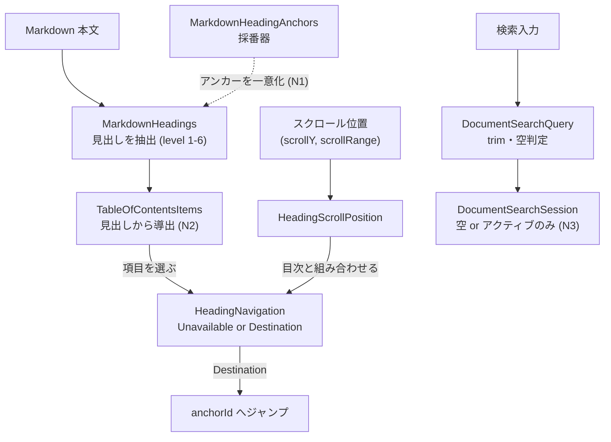

# ドメイン用語集: 文書ナビゲーション・検索

## このドキュメントの目的

文書内を移動するための中核用語——見出し・目次・スクロール位置・検索——を、**構成要素・L1（語が単独で守る規則）・
L2（語と語の間の規則）・L3（動作の規則）**で記す。UI の目次ボタン・検索バー・見出しジャンプが表出する
ドメイン概念はここに対応する（ボタン自体は presentation 層で対象外）。

記法・3階層モデル・「なぜ」の方針はハブ [`domain-glossary.md`](./domain-glossary.md) を参照。

---

## 全体像: 見出しから目次・ジャンプ・検索へ

**読み方**: 本文から `MarkdownHeadings` が見出しを抽出し、`MarkdownHeadingAnchors` が各見出しに一意な
アンカーを与える。目次 `TableOfContentsItems` は見出しから導出され、項目選択で `anchorId` へジャンプする。
スクロール位置は `HeadingScrollPosition` が「表示中の見出し」を推定する。検索入力は `DocumentSearchQuery`
に正規化され、`DocumentSearchSession` は「空 or アクティブなクエリ」だけを保持する。

---

## 語の定義（構成要素 と L1）

- **MarkdownHeading**（`domain/MarkdownHeading.java`）: 1つの見出し。構成要素 `level: int`、`title: String`、`anchorId: String`。
  - L1: `level` は 1〜6、`title`・`anchorId` は非空（いずれも違反で例外）。 なぜ: 見出しは階層（1〜6）を持つ移動単位で、空の見出し・空アンカーは目次にもジャンプにも使えない。
- **MarkdownHeadings**（`domain/MarkdownHeadings.java`）: 見出しの並び。構成要素 `List<MarkdownHeading>`。
  操作 `fromMarkdown(markdown)`/`count()`/`at(i)`/`items()`。 規則→N1・N2。
- **MarkdownHeadingAnchors**（`domain/MarkdownHeadingAnchors.java`）: アンカーID採番器（**状態を持つ可変オブジェクト**。値ではない）。
  構成要素 `counts: Map<String,int>`。操作 `nextAnchorId(title)`。
  - L1: アンカーは小文字英数とハイフンに正規化（空なら `heading`）。同じ基底が再出現したら `-2`, `-3`… を付ける。
    なぜ: 後述 N1（文書内で一意）を満たすための採番規則。
  - L1（注記・探索2026-06-13 P4/P11）: 許容文字は **ASCII の `a–z`/`0–9` とハイフンのみ**（`isAnchorCharacter`）。
    そのため **CJK 等の非 ASCII だけの見出しは基底が空→ `heading` に潰れ**、複数あると `heading`, `heading-2`, `heading-3`… と採番される
    （例: `# 概要`→`heading`、`# 詳細`→`heading-2`）。記号のみの見出しと literal `heading` も同じ基底 `heading` で衝突して採番される。
    なぜ: アンカーは URL/HTML id 断片として ASCII 安全である必要があるため。ジャンプは anchorId の一意性（N1）で成立するので機能上は問題ないが、日本語文書ではアンカーが人間可読にならない既知の帰結。
- **TableOfContentsItem**（`domain/TableOfContentsItem.java`）: 目次の1項目。構成要素 `heading: MarkdownHeading`（非null）、`label: String`（非空）。
  - L1: `heading` 非null・`label` 非空（違反で例外）。 なぜ: 目次項目は必ず見出しと表示ラベルを持つ。
- **TableOfContentsItems**（`domain/TableOfContentsItems.java`）: 目次。構成要素 `List<TableOfContentsItem>`。操作 `from(MarkdownHeadings)`/`count()`/`at(i)`。 規則→N2。
- **HeadingScrollPosition**（`domain/HeadingScrollPosition.java`）: スクロール位置。構成要素 `scrollY: int`、`scrollRange: int`。
  操作 `from(...)`/`fromWebViewMetrics(...)`/`estimatedHeadingIndex(headingCount)`。 規則なし（位置から見出し位置を推定する計算）。
- **HeadingNavigation**（`domain/HeadingNavigation.java`）: 見出し移動の結果。`Unavailable`または、目次と
  範囲内indexを持つ`Destination`のどちらか。操作`from(items, position)`/`selected(items, heading)`/
  `next()`/`previous()`。見出しなしや文書外の見出しに番兵値を割り当てない。規則→N4。
- **DocumentSearchQuery**（`viewer/DocumentSearchQuery.java`）: 検索クエリ。構成要素 `text: String`。
  - L1: `from(raw)` は `trim`（null は `""`）。`isActive()` は非空。 なぜ: 前後空白を無視し、空白だけの入力は「検索なし」とみなす。
- **DocumentSearchSession**（`viewer/DocumentSearchSession.java`）: 検索の状態。構成要素 `query: DocumentSearchQuery`。
  操作 `empty()`/`search(q)`/`clear()`/`hasActiveQuery()`/`queryText()`。 規則→N3。

---

## L2: 語と語の間で守るルール

**N1: アンカーIDは文書内で一意**
- 関係する語: MarkdownHeading.anchorId ← MarkdownHeadingAnchors ／ どこで: `MarkdownHeadingAnchors.nextAnchorId`（重複基底に `-2`, `-3`…）
- 分類: UX ／ 支える判断: 同名見出しでもジャンプ先を一意にする判断。
- なぜ: 同名の見出しが複数あっても、ジャンプ先が一意に定まる必要がある。
- 破ると: 目次から誤った見出しへジャンプする。

**N2: 目次は見出しから導出する（独立に持たない）**
- 関係する語: MarkdownHeadings → TableOfContentsItems ／ どこで: `TableOfContentsItems.from(headings)`
- 分類: quality ／ 支える判断: 目次を見出しの派生にして二重管理を避ける判断。
- なぜ: 目次は見出しの派生。二重管理すると本文と目次が食い違う。
- 破ると: 本文の見出しと目次がずれる。

**N3: 検索セッションは「空」または「アクティブなクエリ」だけを取る**
- 関係する語: DocumentSearchQuery → DocumentSearchSession ／ どこで: `DocumentSearchSession.search`（非アクティブは `empty()` に正規化）
- 分類: quality ／ 支える判断: 無効な検索状態（空白だけ）を作らない判断。
- なぜ: 「非空だが空白だけ」のような中途半端な状態を持たない（不正状態を作らない）。
- 破ると: 空白検索でヒット0の無効状態が画面に残る。

**N4: 見出し移動は「移動不能」または文書内の有効な移動先だけを取る**
- 関係する語: TableOfContentsItems + HeadingScrollPosition → HeadingNavigation ／ どこで: `HeadingNavigation.from`
- 分類: UX・quality ／ 支える判断: スクロール位置を正とし、別の可変indexを持たない判断。
- なぜ: 文書変更や手動スクロール後も、古いindexや`-1`へ依存せず現在の文書内で移動を完結させるため。
- 破ると: 別文書の見出しへの移動、範囲外参照、先頭・末尾での移動停止が起きる。

---

## L3: 動作が守るルール（L1 を保ち L2 を実現する）

- `MarkdownHeadings.fromMarkdown(md)`: 本文から見出しを抽出する。アンカーの一意化は `MarkdownHeadingAnchors`（N1）が担う。
  なぜ: 解析時に見出しとアンカーを一度に確定し、以後一貫させる。
- `TableOfContentsItems.from(headings)`: N2 を実現。見出しごとに目次項目を作る。 なぜ: 目次を見出しの派生として常に同期させる。
- `DocumentSearchSession.search(q)`: N3 を実現。`q` が非アクティブなら `empty()` を返す。 なぜ: 無効なクエリを保持しない。
- `HeadingScrollPosition.estimatedHeadingIndex(count)`: `scrollY` / `scrollRange` から表示中の見出し index を**推定**する。
  なぜ: スクロール位置から「今どの見出しか」を出し、ジャンプや強調に使う（厳密一致でなく近似）。
  - L3（注記・探索2026-06-13 P5/P6）: 写像は `index = round(min(1, scrollY/scrollRange) × (count-1))` で両端をクランプ。
    `count<=0`→`-1`、`count==1` または `scrollRange==0`→`0`。負の `scrollY` は0に、`scrollRange` 超過は最終 index にクランプ。
    例（count=3, range=100）: `scrollY 0–24→0 / 25–74→1 / 75–100→2`（境界は round の中点丸め）。既存 `HeadingScrollPositionTest` が性質を固定済み。
- `HeadingNavigation.next()` / `previous()`: N4を実現。`Destination`では文書内の次・前へ移り、末尾・先頭では
  反対端へ循環する。`Unavailable`では`Unavailable`のままになる。
- `HeadingNavigation.selected(items, heading)`: N4を実現。現在の文書の目次に含まれる見出しだけを
  `Destination`にし、文書外の見出しは`Unavailable`にする。

- `MarkdownHeadings.fromMarkdown(md)` の解析範囲（L3・注記・探索2026-06-13 P3/P7/P14）: パーサが見出しとして認識するのは
  **列0始まりの ATX（`#`×1–6 の直後に半角スペース1つ）のみ**。`#Heading`（スペース無し）・`#\tTitle`（タブ）・
  setext（`===`/`---` 下線）・閉じ ATX の `##` 除去は**非対応**（`## T ##`→title は `T ##` のまま）。
  コードフェンスは **先頭≤3スペースのインデント** と **3個以上のバックティック連**を境界とみなす（[#168](https://github.com/Yos-K/localmd-reader/issues/168) で修正済み: 以前は列0のみ認識し、インデントフェンスや末尾空白付き閉じフェンスを取りこぼしていた）。4スペース以上はフェンスでなくインデントコード扱い。フェンス内の `#` 行は見出しにしない。
  なぜ: 最小で堅牢な見出し抽出に絞る方針。CommonMark 全機能の網羅は目的としないが、フェンス境界の取りこぼしは目次の見出し欠落/誤増という実害があるため CommonMark のインデント・末尾空白規則に合わせる。

- `TableOfContentsItems.from(headings)` のラベル（L3・注記・探索2026-06-13 P13）: ラベルは `(level-1)×2` 個の半角スペースで字下げした title。
  例: L1 `A`→`A`、L3 `C`→`    C`（4スペース）。 なぜ: 目次の階層を字下げで視覚表現するため。

---

## 関連

- 記法・「なぜ」の方針（ハブ）: [`domain-glossary.md`](./domain-glossary.md)
- ビューア・ファイル（タブ・履歴・開く判定）: [`domain-glossary-viewer.md`](./domain-glossary-viewer.md)
- 形式モデル（N1 アンカー一意・N2 目次全単射の Alloy 検査）: [`models/navigation-anchors.als`](./models/navigation-anchors.als)（`scripts/check-domain-model.sh` で検査）
