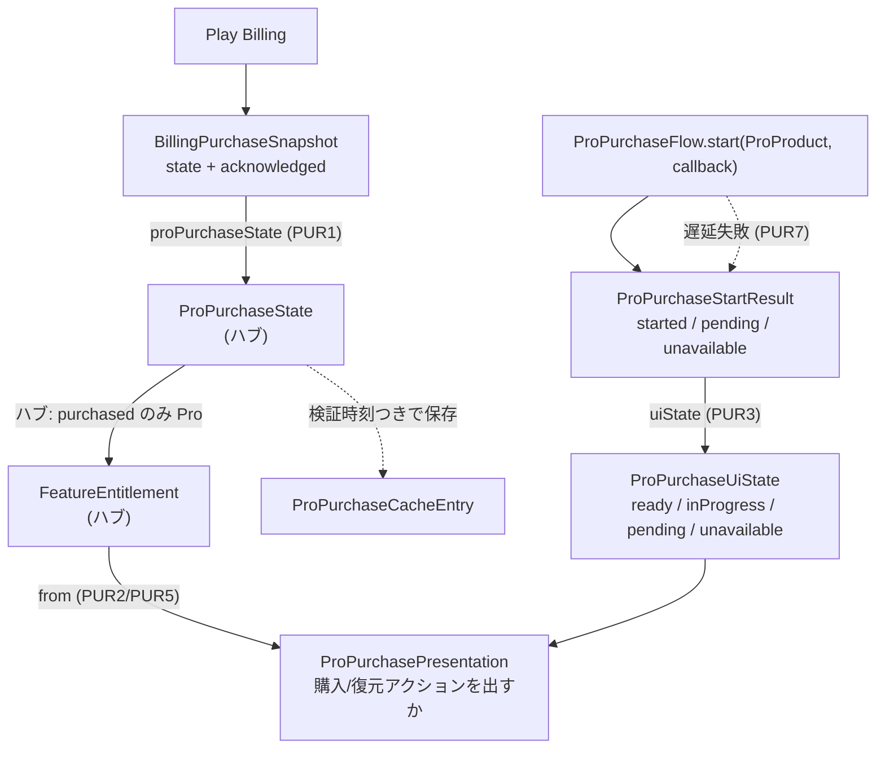

# ドメイン用語集: Pro購入フロー

## このドキュメントの目的

Pro の購入に関わる中核用語——課金フロー・購入結果・UI状態・表示判定・Play Billing との境界——を、
**構成要素・L1（語が単独で守る規則）・L2（語と語の間の規則）・L3（動作の規則）**で記す。

購入状態 `ProPurchaseState`・権限 `FeatureEntitlement`・課金プロダクト `ProProduct` はハブ（権限クラスタ）の語。
本クラスタはそれらと Play Billing をつなぐ。記法・「なぜ」の方針はハブ [`domain-glossary.md`](./domain-glossary.md) を参照。

---

## 全体像: 外部の課金状態を、権限と表示へ落とす

**読み方**: Play Billing の生状態は `BillingPurchaseSnapshot` に取られ、`proPurchaseState()` でドメインの
`ProPurchaseState`（ハブ）へ変換される。そこからハブの規則で権限 `FeatureEntitlement` が決まる。購入操作は
`ProPurchaseFlow.start` が即時の `ProPurchaseStartResult` を返し、Billing 接続・商品取得・購入画面起動の遅延失敗は
`ProPurchaseFlowCallback` で同じ結果語彙へ戻す。それらが `ProPurchaseUiState` に写る。最後に権限と
UI状態から `ProPurchasePresentation` が「購入アクションを出すか」を決める。

---

## 語の定義（構成要素 と L1）

- **ProPurchaseFlow**（`domain/ProPurchaseFlow.java`）: 課金フローの抽象（インターフェース）。操作 `start(ProProduct, ProPurchaseFlowCallback): ProPurchaseStartResult`。
- **ProPurchaseFlowCallback**（`domain/ProPurchaseFlowCallback.java`）: 購入開始後に遅れて確定した開始結果を UI 境界へ返すコールバック。操作 `onPurchaseStartResolved(ProPurchaseStartResult)`。規則→PUR7。
- **UnavailableProPurchaseFlow**（`domain/UnavailableProPurchaseFlow.java`）: 課金不可環境用の no-op 実装（null-object）。
  - L1: `start(product, callback)` は `product`・`callback` 非null必須、結果は常に `unavailable`。遅延結果は通知しない。 なぜ: 課金不可は即時に確定しており、UI の二重更新を避ける（null-object）。
- **ProPurchaseStartResult**（`domain/ProPurchaseStartResult.java`）: 購入開始の結果。構成要素 `value: {started, unavailable, pending}`。
  操作 `uiState()`。 規則→PUR3。
- **ProPurchaseUiState**（`domain/ProPurchaseUiState.java`）: 購入UIの状態。構成要素 `value: {ready, unavailable, pending, inProgress}`。
  - L1: `safe(state)` で null を安全な既定に正規化。 なぜ: null でも壊さない（fail-closed）。
  - 操作 `fromPurchaseState(state)` は `pending` を `pending`、`unknown` / `billingUnavailable` を `unavailable`、
    その他を `ready` に写す。 規則→PUR6。
- **ProPurchaseCacheEntry**（`domain/ProPurchaseCacheEntry.java`）: 検証済み購入状態のキャッシュ。構成要素 `purchaseState: ProPurchaseState`、`verifiedAtMillis: long`。
  - L1: `verifiedAt(state, millis)` は `state` 非null・`millis` 非負（違反で例外）。 なぜ: 「いつ検証したか」を伴わないキャッシュを作らない（AlwaysValid）。
  - 操作 `restore(code, millis)`/`purchaseState()`/`purchaseStateCode()`。
  - L1（注記・探索2026-06-13 P8/P12）: **エントリ自身は TTL/失効を持たない**。`verifiedAtMillis` は「いつ検証したか」の出所情報として保持するだけで、`purchaseState()` は時刻を一切参照しない。
    そのため `restore("purchased", 0L)`（Unix epoch=非常に古い）でも Pro を復元する。永続コード `"purchased"` は過去に Billing で検証済みの事実の記録として**信頼**され、復元時に Play Billing を再照会しない。
    なぜ: Pro は一度きりの購入（失効しない）で、毎起動の Billing 照会を避けてオフラインでも Pro を保つため。鮮度判断・再検証（返金検知等）が要る場合は、`verifiedAtMillis` を使って**呼び出し側が**行うポリシーであり、エントリの責務ではない。
    不正・null コードは `unknown`→Free に倒れる（fail-closed）ので、信頼するのは正規コードのみ。
- **BillingPurchaseSnapshot**（`domain/BillingPurchaseSnapshot.java`）: Play Billing の購入スナップショット（外部境界）。構成要素 `state: int`、`acknowledged: boolean`。
  操作 `purchased(ack)`/`pending()`/`notPurchased()`/`billingUnavailable()`/`proPurchaseState()`。 規則→PUR1。
- **ProPurchasePresentation**（`domain/ProPurchasePresentation.java`）: 購入の表示判定。構成要素 `showAction: boolean`、
  `showRestoreAction: boolean`、`messageCode: String`。
  操作 `from(FeatureEntitlement, ProPurchaseUiState)`/`shouldShowAction()`/`shouldShowRestoreAction()`/`messageCode()`。 規則→PUR2/PUR5。
- **FeatureEntitlements**（`domain/FeatureEntitlements.java`）: 現在の権限を取り出すファサード（静的）。
  - L1: `current(source)` は null source/null 権限を Free に倒す。`currentClosedTestingRelease()` は常に Free。 なぜ: 不明時は最小権限 Free（fail-closed）。クローズドテストは常に Free の方針と整合。
- **ProFeaturePresentationItem**（`domain/ProFeaturePresentationItem.java`）: Pro特典一覧の1項目。構成要素 `feature: ViewerFeature`、`title`、`description`、`available: boolean`。
  - L1: `feature` 非null・`title` 非空（違反で例外）。 なぜ: 提示する特典は必ず機能と表示文言を持つ。
- **ProFeaturePresentation**（`domain/ProFeaturePresentation.java`）: 権限と特典記述子から提示項目を組み立てるファクトリ。
  - L1: `entitlement`・`descriptors`（および各要素）非null必須（違反で例外）。
- **ProFeaturesPresentation**（`domain/ProFeaturesPresentation.java`）: Pro特典画面の全体モデル。構成要素 `pro: boolean`、`features: ProFeaturePresentationItem[]`、`purchase: ProPurchasePresentation`。
  操作 `from(entitlement, ...)`/`isPro()`。 規則→PUR4。

---

## L2: 語と語の間で守るルール

**PUR1: Play Billing → ドメイン購入状態は「`PURCHASED` かつ `acknowledged`」のときだけ `purchased`**
- 関係する語: BillingPurchaseSnapshot → ProPurchaseState ／ どこで: `BillingPurchaseSnapshot.proPurchaseState`
- 分類: safety ／ 支える判断: 未承認購入を確定扱いしない安全判断（収益保護・プライバシー）。
- なぜ: 外部（Play Billing）の生状態をドメイン語彙へ変換する境界。**未承認の購入を確定扱いしない**（承認待ちは `pending`、
  課金不可は `billingUnavailable`）。これとハブの「`purchased` のみ Pro」が二段で「購入済かつ承認済のみ Pro」を保証する。
- 破ると: 未承認・保留の購入で誤って Pro を解放する。

**PUR2: 購入アクションを出すのは「未 Pro かつ ready」のときだけ**
- 関係する語: FeatureEntitlement × ProPurchaseUiState → ProPurchasePresentation ／ どこで: `ProPurchasePresentation.from`
- 分類: UX ／ 支える判断: 既購入・未準備の状態で購入を勧めない（誤誘導しない）判断。
- なぜ: 既に Pro なら購入を勧めない（`PRO_ACTIVE`）。準備できていない（pending / inProgress / unavailable）状態でも勧めない。
- 破ると: 購入済なのに購入ボタンが出る／未準備の状態で購入を促す。

**PUR3: 購入開始の結果は UI 状態に写す**
- 関係する語: ProPurchaseStartResult → ProPurchaseUiState ／ どこで: `ProPurchaseStartResult.uiState`
  （`started` → `inProgress`、`pending` → `pending`、それ以外 → `unavailable`）
- 分類: UX ／ 支える判断: 開始結果を画面状態に一意対応させる判断。
- なぜ: 開始結果を画面が扱う状態へ一意に対応づける。 破ると: 開始結果と画面表示が食い違う。

**PUR4: Pro特典一覧の各項目の `available` は権限から決まる**
- 関係する語: FeatureEntitlement × ViewerFeature → ProFeaturePresentationItem ／ どこで: `ProFeaturesPresentation.from(entitlement, ...)`（各特典について、その機能を許すか）
- 分類: business ／ 支える判断: 特典の利用可否表示を権限と一致させる判断。
- なぜ: 特典一覧の「利用可能か」表示を権限と一致させる（ハブの「権限が機能を許可するか」を提示に反映）。
- 破ると: 使えない特典を利用可能と表示する／その逆。
- 注記（探索2026-06-13 P3/P13）: `available` は **特典自身の tier** で決まる（`entitlement.allows(feature) = pro || feature.isFree()`）。
  言語別の記述子リスト（`ViewerText.proFeatureCatalog()`）への所属で決まるのではない。そのため
  **free-tier の特典をリストに入れると Free 権限でも `available`** になる。
  言語非依存の現行カタログ（`ProFeatureCatalog.initialFeatures()`）と対応する言語別記述子は
  **全10件が Pro-tier** なので、Free では全ロック・Pro では全解放になり、この区別は表面化しない。
  なぜ: 提示の可否は機能の権限そのものに従わせる（リスト編集ミスで権限と表示が食い違わない）。
  2軸の整合: Pro なら全特典解放 + 購入アクション非表示（PUR2）、Free+ready なら全 Pro 特典ロック + 購入アクション表示——権限と提示が一貫する。

**PUR5: 復元アクションを出すのは「未 Pro かつ ready」のときだけ**
- 関係する語: FeatureEntitlement × ProPurchaseUiState → ProPurchasePresentation ／ どこで: `ProPurchasePresentation.from`
- 分類: UX ／ 支える判断: 復元できる可能性がある状態でだけ復元導線を出し、既購入・未準備・処理中の誤操作を避ける判断。
- なぜ: 復元は「購入済みなのに端末状態が未 Pro」の利用者を救う導線であり、Pro 有効時には不要。Billing が未準備、
  pending、inProgress のときに出すと、押しても意味が薄く誤誘導になる。購入ボタンと同じ ready 条件に閉じることで、
  表示条件を UI ではなくドメイン提示モデルに集約する。
- 破ると: Pro 有効時に復元ボタンが出る／Billing 未準備や処理中に押せるボタンが出る。

**PUR6: 購入状態から UI 状態へ復元表示用に写す**
- 関係する語: ProPurchaseState → ProPurchaseUiState ／ どこで: `ProPurchaseUiState.fromPurchaseState`
- 分類: UX ／ 支える判断: 復元結果を購入UIの状態へ一意対応させる判断。
- なぜ: 復元処理は Play Billing の現在状態を `ProPurchaseState` として受け取り、画面は `ProPurchaseUiState` を見る。
  `pending` は保留表示、`unknown` / `billingUnavailable` は利用不可表示へ倒し、それ以外は ready として購入/復元導線の
  再表示に使える状態へ戻す。Pro 有効表示そのものは権限側が決める。
- 破ると: 復元結果と画面状態が食い違い、復元後の購入/復元導線が不正になる。

**PUR7: 購入開始後の Billing 遅延失敗は `unavailable` として戻す**
- 関係する語: ProPurchaseFlow × ProPurchaseFlowCallback → ProPurchaseStartResult ／ どこで: `PlayBillingPurchaseFlow`
- 分類: UX / safety ／ 支える判断: 購入処理が途中で失敗しても UI を `inProgress` に閉じ込めない判断。
- なぜ: Play Billing は接続・商品取得・購入画面起動が非同期に失敗しうる。`start` の即時戻り値だけでは「開始したが後で失敗した」状態を表せないため、
  遅延失敗も `ProPurchaseStartResult.unavailable` という同じドメイン語彙に戻し、`PUR3` に従って UI を `unavailable` へ復帰させる。
- 破ると: 課金画面を開けなかったときに購入UIが処理中表示のまま残る。

---

## L3: 動作が守るルール（L1 を保ち L2 を実現する）

- `BillingPurchaseSnapshot.proPurchaseState()`: PUR1 を実現。`PURCHASED && acknowledged` のみ `purchased`、
  `PURCHASED`（未承認）/`PENDING` は `pending`、`BILLING_UNAVAILABLE` は `billingUnavailable`、他は `notPurchased`。
  なぜ: 承認済みだけを確定購入とみなす安全側の変換。
- `ProPurchasePresentation.from(e, ui)`: PUR2/PUR5 を実現。`e` が Pro なら購入/復元アクションを非表示、`ui` が ready なら
  購入/復元アクションを表示、他は非表示＋理由メッセージ。`e == null` は Free。
  なぜ: 状態に応じて購入導線を出し分け、誤誘導を防ぐ。
- `ProPurchaseUiState.fromPurchaseState(state)`: PUR6 を実現。`pending` は `pending`、`unknown` / `billingUnavailable` は
  `unavailable`、その他は `ready`。なぜ: 復元結果を UI が扱う状態へ安全側に写す。
- `ProPurchaseFlow.start(product, callback)`: 即時に分かる開始結果を戻す。Billing 実装は接続・商品取得・購入画面起動の遅延失敗を
  `callback.onPurchaseStartResolved(ProPurchaseStartResult.unavailable())` で返す（PUR7）。
  なぜ: 非同期失敗も同じ購入開始結果モデルに畳み、UI の処理中表示を確実に解除する。
- `FeatureEntitlements.current(source)`: source から現在権限を取り、null 系は Free に倒す。 なぜ: 不明時は安全側 Free（fail-closed）。

---

## 関連

- 記法・「なぜ」の方針（ハブ）・`ProPurchaseState` / `FeatureEntitlement` / `ProProduct`: [`domain-glossary.md`](./domain-glossary.md)
