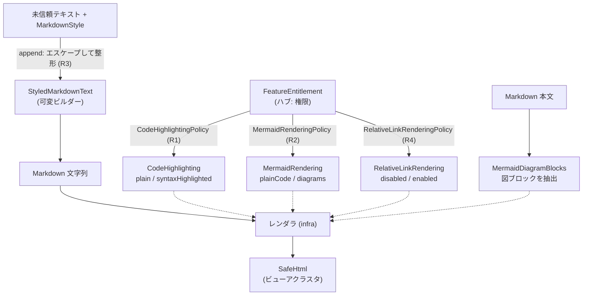

# ドメイン用語集: 描画・スタイル

## このドキュメントの目的

Markdown を画面に描く中核用語——書式・コードハイライト・Mermaid 図・相対リンク——を、**構成要素・L1（語が単独で守る規則）・
L2（語と語の間の規則）・L3（動作の規則）**で記す。描画結果の信頼境界（`SafeHtml`）はビューアクラスタ、
権限による機能オン/オフはハブ（権限クラスタ）と接続する。

記法・3階層モデル・「なぜ」の方針はハブ [`domain-glossary.md`](./domain-glossary.md) を参照。

---

## 全体像: 設定の導出と、テキストの安全な整形

**読み方**: 権限から `CodeHighlightingPolicy` / `MermaidRenderingPolicy` / `RelativeLinkRenderingPolicy` が描画設定（オン/オフ）を導く。
本文の各断片は `StyledMarkdownText` が**エスケープしつつ** Markdown に整形する。これらと抽出した図ブロックを
レンダラ（infra層）が組み立て、最終的に `SafeHtml`（ビューアクラスタ）になって reader WebView に渡る。

---

## 語の定義（構成要素 と L1）

- **MarkdownStyle**（`domain/MarkdownStyle.java`）: 1断片の書式。構成要素 `bold`/`italic`/`underline`/`linkUrl`/`headingLevel`/`bulletListItem`。
  操作 `plain()`＋`withBold()` 等の合成。 規則なし（書式の記述。`with*` で新インスタンス）。
- **StyledMarkdownText**（`domain/StyledMarkdownText.java`）: 書式付きテキストを Markdown 文字列に組み立てる
  **可変ビルダー**（`StringBuilder` 内蔵。値ではない）。操作 `append(text, style)`/`value()`。
  - L1: `text`/`style` が null でも安全な既定（`""` / `plain()`）に倒す。 なぜ: null でも壊さない（fail-closed）。
- **CodeHighlighting**（`domain/CodeHighlighting.java`）: コードハイライト設定。構成要素 `enabled: boolean`（`plain()` / `syntaxHighlighted()`）。 規則→R1。
- **CodeHighlightingPolicy**（`domain/CodeHighlightingPolicy.java`）: 権限から `CodeHighlighting` を導く（静的）。 規則→R1。
- **MermaidRendering**（`domain/MermaidRendering.java`）: Mermaid 描画設定。構成要素 `enabled: boolean`（`plainCode()` / `diagrams()`）。 規則→R2。
- **MermaidRenderingPolicy**（`domain/MermaidRenderingPolicy.java`）: 権限から `MermaidRendering` を導く（静的）。 規則→R2。
- **RelativeLinkRendering**（`domain/RelativeLinkRendering.java`）: 相対 Markdown リンクのアンカー化設定。構成要素
  `enabled: boolean`（`disabled()` / `enabled()`）。 規則→R4。
- **RelativeLinkRenderingPolicy**（`domain/RelativeLinkRenderingPolicy.java`）: 権限から `RelativeLinkRendering` を導く（静的）。 規則→R4。
- **LocalRelativeMarkdownLink**（`file/LocalRelativeMarkdownLink.java`）: reader WebView から来たローカル相対 Markdown
  リンク要求の解決結果。構成要素 `available: boolean`、`filePath: String`、`targetAnchorId: String`。
  - L1: `available == false` のとき `filePath` と `targetAnchorId` は空。`available == true` のとき
    `filePath` は許可ルート配下の正規化済み絶対パス、`targetAnchorId` は URL フラグメント由来の任意アンカー（空可）。
    なぜ: リンク先ファイルと見出しジャンプ対象を1つの結果型に閉じ、呼び出し側に URL 解析と安全判定を漏らさない。
- **MermaidDiagramBlock**（`domain/MermaidDiagramBlock.java`）: 1つの Mermaid 図ソース。構成要素 `source: String`。
  - L1: `source` 非空（違反で例外）。 なぜ: 空の図ソースは描画対象にならない。
- **MermaidDiagramBlocks**（`domain/MermaidDiagramBlocks.java`）: 本文から抽出した図ブロック群。構成要素 `MermaidDiagramBlock[]`。
  操作 `fromMarkdown(md)`/`isEmpty()`。 規則なし（抽出した図ブロックの集合）。

---

## L2: 語と語の間で守るルール

**R1: コードハイライトの有無は権限から導出する**
- 関係する語: FeatureEntitlement → CodeHighlighting ／ どこで: `CodeHighlightingPolicy.fromEntitlement`
  （`CODE_HIGHLIGHTING` を許せば `syntaxHighlighted`、でなければ `plain`）
- 分類: business ／ 支える判断: 機能オン/オフを権限と一元的に結ぶ判断（現状は Free）。
- なぜ: 機能のオン/オフを権限と一元的に結びつける（ハブの「権限が機能を許可するか」を描画に反映）。
  ※ `CODE_HIGHLIGHTING` は現状 Free 機能のため、実際は全ユーザーで有効になる（仕組みは将来の階層変更にも耐える）。
- 破ると: 権限と表示が食い違う。

**R2: Mermaid 描画の有無は権限から導出する**
- 関係する語: FeatureEntitlement → MermaidRendering ／ どこで: `MermaidRenderingPolicy.fromEntitlement`
  （`MERMAID_RENDERING` を許せば `diagrams`、でなければ `plainCode`）
- 分類: business ／ 支える判断: 機能オン/オフを権限と一元的に結ぶ判断（現状は Free）。
- なぜ: R1 と同じ。※ `MERMAID_RENDERING` も現状 Free のため実際は全ユーザーで有効。
- 破ると: 権限と表示が食い違う。

**R3: スタイル適用時にテキストをエスケープする**
- 関係する語: StyledMarkdownText × MarkdownStyle → Markdown 文字列 ／ どこで: `StyledMarkdownText.append`
  （`escapeMarkdown` / `escapeUrl` / 表セルの `|` エスケープ）
- 分類: safety ／ 支える判断: 未信頼テキストの記法注入を防ぐ判断（`SafeHtml` と同じ思想を整形前段で）。
- なぜ: 未信頼テキストが Markdown 記法やマークアップを注入できないようにする。`SafeHtml`（描画後の信頼境界）と
  同じ思想を**整形の前段**で適用する。
- 破ると: ユーザーテキストが書式・リンク・表を偽装する。

**R4: 相対リンクのアンカー化は権限から導出する**
- 関係する語: FeatureEntitlement → RelativeLinkRendering ／ どこで: `RelativeLinkRenderingPolicy.fromEntitlement`
  （`RELATIVE_LINKS` を許せば `enabled`、でなければ `disabled`）
- なぜ: ローカル文書セット内の移動は Pro の効率化機能だが、危険な URL スキームを許すと信頼境界が崩れる。
  **だから**権限で有効化を制御しつつ、レンダラ側では `file:` / 独自スキーム / ルート相対 / プロトコル相対 URL を
  アンカーとして出力しない。
- 分類: safety ／ 支える判断: Pro 効率化（文書間移動）を提供しつつ、危険なURLスキームを出力しない判断。
- 破ると: Free/Pro 境界とリンク安全性が食い違う。

**R5: 相対画像の画像タグ化は権限から導出する**
- 関係する語: FeatureEntitlement → RelativeImageRendering ／ どこで: `RelativeImageRenderingPolicy.fromEntitlement`
  （`RELATIVE_IMAGES` を許せば `enabled`、でなければ `disabled`）
- なぜ: ローカル文書セット内の画像表示は Pro の読みやすさ向上だが、任意の URL を画像タグにすると信頼境界が崩れる。
  **だから**権限で有効化を制御しつつ、レンダラ側では安全な相対パスだけを `img` として出力し、`file:` / 独自スキーム /
  ルート相対 / プロトコル相対 / リモート URL は alt テキストのままにする。
- 分類: safety ／ 支える判断: Pro のローカル画像表示価値を提供しつつ、危険なURLスキームを出力しない判断。
- 破ると: Free/Pro 境界と画像読み込みの安全性が食い違う。

---

## L3: 動作が守るルール（L1 を保ち L2 を実現する）

- `CodeHighlightingPolicy.fromEntitlement(e)` / `MermaidRenderingPolicy.fromEntitlement(e)`: R1 / R2 を実現。`e == null` は Free 扱い。
- `RelativeLinkRenderingPolicy.fromEntitlement(e)` / `RelativeImageRenderingPolicy.fromEntitlement(e)`: R4 / R5 を実現。`e == null` は Free 扱い。
  なぜ: 権限が不明なときは安全側の Free に倒す（fail-closed）。
- `LocalRelativeMarkdownLink.resolve(documentUri, requestUrl, allowedRootPath)`: R4 を WebView 側で実現。
  レンダラは相対 Markdown リンクを `https://localmd.local/__relative_markdown__?path=<encoded-relative-path>` に
  変換し、WebView が `../` を解決して消す前の相対パスを保持する。リンク要求は、開いている `file:` 文書の
  ディスク上ディレクトリ基準で解決し、`.md` / `.markdown` のみを開く対象にする。**許可範囲は presentation 層から
  渡されたルート配下のみ**（canonicalPath で確認し、root 超過 traversal・別 host・非 https・`content:` 文書・
  Markdown 以外の拡張子は弾く）。URL フラグメントは `targetAnchorId` として保持し、リンク先ファイルを開いた後の
  見出しジャンプに使う。`+` を含むファイル名はレンダラが `%2B` としてエンコードし、空白とは区別する。
  なぜ: ローカル文書セット内の `guide/intro.md#section` のような移動を可能にしつつ、文書セット外の任意ファイルを
  開くことを防ぐ（traversal 防御）。
- `LocalRelativeImageResource.resolve(documentUri, requestUrl, allowedRootPath)`: R5 を WebView 側で実現。
  レンダラは相対画像を `https://localmd.local/__relative_image__?path=<encoded-relative-path>` に変換し、WebView が
  `../` を解決して消す前の相対パスを保持する。画像リクエストは、開いている `file:` 文書のディスク上ディレクトリ基準で
  解決する。**許可範囲は presentation 層から渡されたルート配下のみ**（canonicalPath で確認し、root 超過 traversal・
  二重エンコード traversal・別 host・非 https・`content:` 文書・画像以外の拡張子は弾く）。ルート未指定の旧 API は
  文書ディレクトリ配下だけを許す。
  なぜ: `docs/sub/readme.md` から `../images/x.png` を参照する一般的な文書セットは表示しつつ、文書セット外の任意ファイルを
  読み出して表示するのを防ぐ（traversal 防御）。
- `RelativeLinkRenderingPolicy.fromEntitlement(e)`: R4 を実現。`e == null` は Free 扱い。
  なぜ: 権限が不明なときは相対リンクをアンカー化しない安全側に倒す（fail-closed）。
- `StyledMarkdownText.append(text, style)`: R3 を実現。本文をエスケープし、太字・斜体・リンク・見出し・箇条書き・
  タブ区切り表へ整形して追記する。 なぜ: 未信頼テキストの注入を防ぎつつ、意図した書式だけを与える。
- `MermaidDiagramBlocks.fromMarkdown(md)`: 本文から Mermaid コードブロックを抽出する。 なぜ: 図の描画可否（R2）と
  描画対象（抽出結果）を分けて扱えるようにする。

---

## 関連

- 記法・「なぜ」の方針（ハブ）・権限クラスタ: [`domain-glossary.md`](./domain-glossary.md)
- 描画結果の信頼境界 `SafeHtml`: [`domain-glossary-viewer.md`](./domain-glossary-viewer.md)
