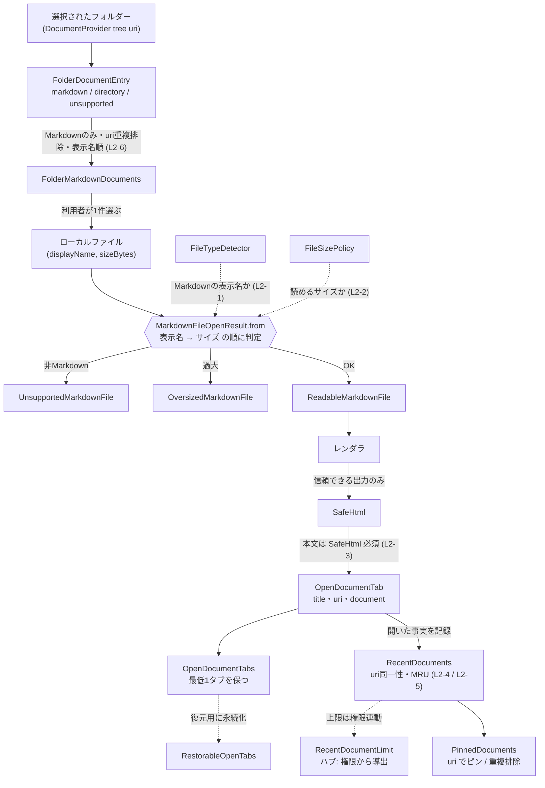

# ドメイン用語集: ビューア・ファイル

## このドキュメントの目的

ビューアで「読む対象」——ファイルを開く判定・ドキュメント・タブ・履歴・操作——の中核用語を、
**構成要素・L1（語が単独で守る規則）・L2（語と語の間の規則）・L3（動作の規則）**で記す。

記法・3階層モデル・「なぜ」の方針、および権限(Free/Pro)側の用語は、ハブの
[`domain-glossary.md`](./domain-glossary.md) を参照（同じ方針をここでも用いる：全規則に「なぜ」を付し、
規則を持たないデータは「規則なし」、規則が他クラスタにある語は参照を指す）。

---

## 全体像: ローカルファイルを開いて表示・記録する流れ

このクラスタの中心は「ファイルを開き → 安全に描画し → タブに載せ → 履歴に残す」ライフサイクル。
A〜C の各語はこの流れの段階に対応する（D の操作・表示は流れに直交する設定なので別掲）。図中の `L2-*`
は本ファイル内の同名ルール。

**読み方**: ファイルはまず `MarkdownFileOpenResult.from` で「表示名→サイズ」の順に判定され、
`Unsupported` / `Oversized` / `Readable` のいずれかになる。`Readable` だけがレンダラを経て `SafeHtml`
になり、タブ本文として載る（本文は `SafeHtml` 必須＝XSS境界）。開いた事実は `RecentDocuments` に MRU で
記録され（同一性は `uri`、上限はハブの `RecentDocumentLimit` で権限連動）、`PinnedDocuments` でピンできる。
タブ集合は `RestorableOpenTabs` として復元用に永続化される。

---

## A. ファイルを開く判定（ファイル → 結果型）

### 語の定義（構成要素 と L1）

- **FileTypeDetector**（`file/FileTypeDetector.java`）: 表示名から Markdown かを判定。
  操作 `isMarkdownDisplayName(name)`。 規則→L2-1。
- **FileSizePolicy**（`file/FileSizePolicy.java`）: 読めるサイズの方針。構成要素 `maxSizeBytes: long`、`UNKNOWN_SIZE = -1`。
  - L1: `isReadableSize` は サイズ不明(`-1`) または `0〜maxSizeBytes` を読める扱い。
    なぜ: サイズ不明でも描画を試せるよう寛容にし、負値は不正として弾く。
- **MarkdownFileOpenResult**（`file/MarkdownFileOpenResult.java`）: 開いた結果（結果型）。構成要素は3ケース
  `ReadableMarkdownFile{displayName, sizeBytes}` / `UnsupportedMarkdownFile` / `OversizedMarkdownFile`。
  - L1: `ReadableMarkdownFile.of` は Markdown表示名と妥当なサイズを再強制（AlwaysValid）。
    なぜ:「読める」を表す型は、常に読める前提を満たす。
- **FolderDocumentEntry**（`file/FolderDocumentEntry.java`）: フォルダー選択後に見つかった1件。
  構成要素 `kind: {markdown, directory, unsupported}`、`displayName: String`、`uri: String`。
  - L1: `displayName` と `uri` は非空。`markdownFile` は Markdown表示名だけ受け付け、
    `unsupportedFile` は Markdown表示名を拒否する。`directory` はディレクトリ種別だけを表す。
    なぜ: フォルダーから選ばせる候補の種類を失わず、Markdown候補だけを後続の開く処理へ渡すため。
- **FolderMarkdownDocuments**（`file/FolderMarkdownDocuments.java`）: フォルダー内から選べる Markdown 候補一覧。
  構成要素 `items: FolderDocumentEntry[]`（Markdownのみ）。
  - L1: `items` は Markdown候補だけを含む。`isEmpty()` / `items()` で利用する。
    なぜ: UI側が「開けない候補」を含む一覧を扱わずに済むよう、境界で選択可能な候補だけに絞る。

### L2: 語と語の間で守るルール

**L2-1: Markdown表示名でなければ `Unsupported`**
- 関係する語: FileTypeDetector → MarkdownFileOpenResult ／ どこで: `MarkdownFileOpenResult.from`
- 分類: quality ／ 支える判断: 非Markdownを読み対象にしない（読める対象だけ扱う）判断。
- なぜ: 非Markdownを読み対象にせず、境界で結果型に落とす（Parse, don't validate）。
- 破ると: 非対応ファイルを開こうとして失敗・誤表示。

**L2-2: 読めるサイズでなければ `Oversized`**
- 関係する語: FileSizePolicy → MarkdownFileOpenResult ／ どこで: `MarkdownFileOpenResult.from`
- 分類: safety ／ 支える判断: 過大ファイルでメモリ・描画を破綻させない判断。
- なぜ: 過大ファイルでメモリ・描画が破綻しないよう境界で弾く。
- 破ると: 巨大ファイルでクラッシュ・フリーズ。

**L2-6: フォルダー内候補は Markdown のみを表示し、同じ uri は最初の1件にまとめ、表示名順で選ばせる**
- 関係する語: FolderDocumentEntry → FolderMarkdownDocuments ／ どこで: `FolderMarkdownDocuments.from`
- 分類: UX ／ 支える判断: Androidのファイルピッカーで見つけにくい Markdown を、フォルダー単位で素早く選べるようにする判断。
- なぜ: 「フォルダーを開く」ワークスペース機能ではなく、選択済みフォルダー内の Markdown を選ぶ補助機能であるため。
  非Markdownやディレクトリを候補に混ぜず、同じファイルの重複を避け、利用者が探しやすい順に並べる。
- 破ると: 非対応ファイルが候補に出る、同じファイルが重複する、一覧から目的のファイルを探しにくくなる。

### L3: 動作が守るルール

- `MarkdownFileOpenResult.from(name, size, policy)`: L2-1 → L2-2 の順に判定し、通れば `Readable`。
  なぜ: 安い判定（表示名）を先に、コストのかかるサイズ判定を後に置く。
- Markdown 表示名の判定は**最終拡張子のみ**を見る（`.md`/`.markdown`、大文字小文字不問。
  `note.md.txt` は非対応）。（探索 2026-06-12 P1 で観測。出典: `exploration-sessions/2026-06-12-viewer.md`）
- `FolderMarkdownDocuments.from(entries)`: L2-6 を実現する。入力にディレクトリや非Markdownが混ざっていても、
  出力は Markdown 候補だけになる。なぜ: Android の DocumentProvider から返る混在した行を、利用者が選べる対象に変換するため。
- UI文言は「フォルダーを開く」ではなく「フォルダーから選ぶ」とする。
  なぜ: フォルダー全体をワークスペースとして開く機能ではなく、フォルダー内の Markdown を選択して開く機能だから。
- フォルダー内候補一覧は、候補がある場合も空の場合も、閉じる導線と別フォルダーを選ぶ導線を持つ。
  なぜ: 一度フォルダーを選んだあとに、同じ画面から選び直せないと Android の分かりにくいフォルダー構造を探索し直せないため。
- 履歴系の一覧ダイアログは、削除操作とは別に閉じる導線を持つ。
  なぜ: 「閉じる」と「履歴を消す」は別操作であり、閉じるために破壊的操作を選ばせないため。

---

## B. ドキュメントとタブ

### 語の定義（構成要素 と L1）

- **DocumentUri**（`domain/DocumentUri.java`）: 文書をタブ・描画・非同期ジョブの間で同定する値オブジェクト。
  構成要素 `value: String`。操作 `from(String)` / `value()`。
  - L1: 生成時に前後空白を除去し、nullまたは空文字を拒否する。同一性とハッシュ値は正規化済み値に基づく。
    なぜ: 生文字列では各モデルが非空確認と同一性判断を重複し、空URIや正規化前後の不一致を内部へ持ち込めるため。
- **SafeHtml**（`domain/SafeHtml.java`）: 表示して安全な、描画済みHTML。構成要素 `value: String`。
  - L1: 非null。生成は `fromTrustedRendererOutput(String)` のみ。
    なぜ: reader WebView は JavaScript 無効（Hard Constraint・XSS対策）。信頼できるレンダラ出力だけを
    「安全HTML」とし、未信頼Markdown由来の生HTMLを混ぜない境界を型で示す。
- **OpenDocumentTab**（`viewer/OpenDocumentTab.java`）: 開いている1タブ（抽象基底＋種別サブタイプ）。
  構成要素 `title: String`、`uri: DocumentUri`、`document: SafeHtml`、種別（Welcome / FileDocument / ClipboardDraft / SelectedTextDraft）。
  - L1: `uri` は常に有効な`DocumentUri`、`title` 空は "Untitled Markdown" に正規化、`document` 非null。
    なぜ（uri必須）: `uri` が識別子で、空だと同一性・復元が壊れる。 なぜ（title正規化）: タブには常に表示ラベルが要る。
  - `UserDocumentTab = FileDocumentTab OR DraftDocumentTab`。ユーザーが開いた・作った文書だけを表し、
    `WelcomeTab`を含めない。なぜ: ProのHTML出力・印刷対象をURI判定ではなく型で限定する。
- **DraftMarkdownDocument**（`viewer/DraftMarkdownDocument.java`）: ファイル由来でない一時Markdown。
  構成要素 `displayName`、`uri`、`markdown`、`rendered: SafeHtml`。 規則なし（一時ドキュメントのデータ。本文は SafeHtml）。
- **OpenDocumentTabs**（`viewer/OpenDocumentTabs.java`）: 開いているタブ集合＋アクティブ位置（不変）。
  構成要素 `tabs`、`activeIndex`。操作 `open`/`activate`/`activatePrevious`/`activateNext`/`closeOrFallback`/`activeTab`。
  - L1: 常に最低1タブを保つ。最後の1枚を閉じる操作はfallbackタブへ置換する。
    なぜ: 空タブ状態を作らず、常に表示できるものを保つ。
- **OpenDocumentTabSession**（`viewer/OpenDocumentTabSession.java`）: `OpenDocumentTabs`の唯一の可変な所有者。
  操作 `open`/`activate`/`activatePrevious`/`activateNext`/`closeOrFallback`/`replaceRenderedDocument`と、
  現在の不変スナップショットを返す`tabs`。
  - L1: 保持する値は常に有効な`OpenDocumentTabs`であり、文書タブの変更はすべてセッション操作を通る。
    なぜ: ファイル、Intent、下書き、ジェスチャー、非同期描画という複数入口からの直接代入をなくし、所有権を一意にする。
- **DocumentTabCloseResult**（`viewer/DocumentTabCloseResult.java`）: タブを閉じる全域的な遷移結果。
  `Closed{nextTabs, closedTab}` または `Unchanged{tabs}` を内部型として持ち、操作 `tabs()` / `renderingSessionAfter(session)` を公開する。
  - L1: `Closed`だけが閉じたタブと同じURIの描画状態を除去し、`Unchanged`はタブ・描画セッションを同一のまま返す。
    なぜ: 呼び出し側に範囲判定、URI抽出、成功時だけの描画状態更新を分散させない。
- **DocumentTabSessionController**（`presentation/DocumentTabSessionController.java`）: 選択・閉じる・前後移動を
  `OpenDocumentTabSession`へ指示した後のapplication境界の完了処理。状態メッセージ消去、表示更新、文書描画、
  復元用保存を必ず同じ順序で実行する。タブ状態自体や、新規文書を開く際の入力元固有方針は所有しない。
- **TabStatusMessage**（`viewer/TabStatusMessage.java`）: タブの状態メッセージ。`none()` / `temporaryMarkdown()` / `selectedTextMarkdown()`。
  操作 `localized(ViewerText)`。 規則なし（`OpenDocumentTab.statusMessage()` が返す表示用メッセージ。文言の言語化は `ViewerText`）。
- **ClipboardMarkdownItem**（`viewer/ClipboardMarkdownItem.java`）: クリップボード由来の Markdown 素材。構成要素 `title: String`、`markdown: String`。
  規則なし（クリップボードから下書き（`DraftMarkdownDocument`）を作る素材）。
- **PinnedDocumentMenuVisibility**（`viewer/PinnedDocumentMenuVisibility.java`）: ピン留めメニューの表示条件。
  構成要素 `pinnedDocumentsAvailable`、`activeTabIsFile`、`activeFileIsPinned`。
  - L1: `canPinCurrentFile` はピン留め機能が利用可能、かつアクティブタブが未ピンのファイルであるときだけ true。
    `canUnpinCurrentFile` はピン留め機能が利用可能、かつアクティブタブがピン済みファイルであるときだけ true。
    なぜ: ピン留め済みかどうかで利用できる操作を一意にし、逆操作や無効操作をメニューに出さない。

### L2: 語と語の間で守るルール

**L2-3: タブ／下書きの本文は SafeHtml でなければならない**
- 関係する語: OpenDocumentTab.document・DraftMarkdownDocument.rendered → SafeHtml ／ どこで: 型（コンストラクタが `SafeHtml` を要求）＝構造的に強制
- 分類: safety ／ 支える判断: 未信頼HTMLをWebViewに渡さない判断（XSS対策、Hard Constraintと一体）。
- なぜ: reader WebView の JS 無効と一体の XSS 境界。型で渡せる本文を「安全HTML」に限定する。
- 破ると: 未信頼HTMLが WebView に渡る。

### L3: 動作が守るルール

- `OpenDocumentTabs.closeOrFallback(index, fallback)`: 有効位置なら閉じたタブを保持する`Closed`結果を返し、最後の1枚は
  `fallback`で初期化する。範囲外なら`Unchanged`結果を返す。
  なぜ: L1（最低1タブ）を保ち、UI連打などの無効な閉じる要求も例外や部分更新にせず全域的に扱うため。
- `DocumentTabCloseResult.renderingSessionAfter(session)`: `Closed`だけが閉じたURIを描画セッションから除去し、
  `Unchanged`は入力セッションを保つ。なぜ: タブ集合と描画状態の更新成否を同じ結果型に閉じるため。
- `OpenDocumentTabSession`の各操作: 次の`OpenDocumentTabs`を所有者自身へ反映し、呼び出し側に再代入を要求しない。
  描画済み文書の置換は対象URIが存在する場合だけ結果ハンドラへ通知する。
  なぜ: すべての入口で同じ所有規則を守り、存在しない非同期完了を全域的な変更なし結果として扱うため。
- `DocumentTabSessionController.activate/close/activatePrevious/activateNext`: `OpenDocumentTabs`の遷移後に
  状態、表示、描画、永続化を一括して完了する。なぜ: clickとgestureのどちらから操作しても同じセッション結果にするため。
- タブ操作の実態（探索 2026-06-12 で観測。出典: `exploration-sessions/2026-06-12-viewer.md`）:
  - `close(activeIndex)` 後のアクティブは**次のタブ**（末尾を閉じたときは前）＝ activeIndex のクランプ。
  - `activatePrevious()`/`activateNext()` は端で**巡回**する（先頭→末尾・末尾→先頭。
    ジェスチャの next_tab/previous_tab が2タブで常に切り替わるのはこのため）。
  - 既存 `uri` のタブを `open` すると**重複タブを作らず既存位置で置換して activate**（タイトルも新値に更新）。
  - 範囲外インデックスの防御は非対称: `activate` は IllegalArgumentException（fail-fast）、`closeOrFallback` は`Unchanged`。
    （**裁可済み 2026-06-12・処方的裁可＝条件付き意図**: 元コードはAI生成で復元すべき意図が存在しないため、
    「何であるべきか」として裁可。activate＝内部不変条件の fail-fast — 永続化由来のインデックスは境界型
    `RestorableOpenTabs.from` が [0, タブ数-1] に正規化するため範囲外は到達しない（C節 L1）。
    close＝UI 連打への冪等。**条件**＝境界正規化が保たれること。テスト
    `fromClampsNegativeActiveIndexToTheFirstTab` / `fromClampsTooLargeActiveIndexToTheLastTab` が固定済み）

---

## C. 履歴・固定・復元

### 語の定義（構成要素 と L1）

- **RecentDocument**（`file/RecentDocument.java`）: 最近開いた1件。構成要素 `displayName`、`uri`。
  - L1: `uri` 非空必須、`displayName` 空は "Untitled Markdown" に正規化。 なぜ（uri必須）: `uri` が同一性（重複判定の鍵）。
- **RecentDocuments**（`file/RecentDocuments.java`）: 最近一覧（不変・上限つき）。構成要素 `maxItems`、`items`。
  - L1: `maxItems >= 1`、件数 ≤ `maxItems`。操作 `recordOpened`/`clear`。
- **PinnedDocuments**（`file/PinnedDocuments.java`）: ピン留め集合（不変・上限つき）。構成要素 `maxItems`、`items`。
  - L1: `maxItems >= 1`、件数 ≤ `maxItems`。操作 `pin`/`unpin`/`containsUri`。
- **RestorableOpenTab / RestorableOpenTabs**（`file/RestorableOpenTab.java` ほか）: 再起動後の復元用最小情報。
  構成要素 `title`、`uri`（集合は ＋`activeIndex`）。本文は持たない。
  - L1: `from` は null タブ・重複 uri を除外し、**結果が空なら `empty()`**（`activeIndex`=0。**利用前に
    `isEmpty()` で分岐するのが契約**で、復元実装も最初に空判定する）。**非空なら `activeIndex` を
    [0, タブ数-1] に正規化**する（Parse, don't validate）。
    なぜ: 永続化データは壊れうる外部入力。境界で検証済み型に畳むことで、非空経路では復元先の
    `activate`（範囲外は例外）へ不正値が到達しない。空経路は isEmpty() 分岐が初期タブへ逃がす。
    ※従来「規則なし」と記載していたが実装にクランプ規則が存在した（2026-06-12 訂正）。

### L2: 語と語の間で守るルール

**L2-4: 最近／ピンの同一性は `uri`、重複は `uri` で排除**
- 関係する語: RecentDocument × RecentDocuments/PinnedDocuments ／ どこで: `recordOpened`/`pin`（`uri.equals` で除外）
- 分類: UX ／ 支える判断: 同じファイルを履歴に二重に積まない判断。
- なぜ: 同じファイルを二重に積まない。 破ると: 履歴が重複で埋まる。

**L2-5: 開いた／ピンしたものを先頭へ、上限超過は古いものから落とす（MRU）**
- 関係する語: RecentDocuments.recordOpened・PinnedDocuments.pin ／ どこで: 各操作
- 分類: UX ／ 支える判断: 最近・優先のものを前に保つ判断（MRU）。
- なぜ: 最近・優先のものを前に保ち、上限内に収める。 破ると: 並び順・上限が崩れる。

> 上限（`maxItems`）の出所: 履歴の表示上限は権限連動（ハブの **RecentDocumentLimit**＝権限から履歴上限を導出するルールを参照）。
> `RecentDocuments` 自体は受け取った `maxItems` を守るだけで、権限は解釈しない。

### L3: 動作が守るルール

- `RecentDocuments.recordOpened(d)` / `PinnedDocuments.pin(d)`: L2-4（uri重複排除）と L1（件数 ≤ maxItems）を保ち、
  先頭追加＋上限切り詰め。新インスタンスを返す。 なぜ: イミュータブル更新（更新＝生成）で不変条件を常に満たす。

---

## D. 操作・表示

### 語の定義（構成要素 と L1）

- **GestureShortcutBinding**（`viewer/GestureShortcutBinding.java`）: 「トリガー → 動作」の1対応。
  構成要素 `trigger: GestureShortcutTrigger`、`action: GestureShortcutAction`。 規則なし（対応の組）。
  - **GestureShortcutTrigger**: `double_tap` / `circle` / `custom_shape` / `swipe_left` / `_right` / `_up` / `_down` の7種。
  - **GestureShortcutAction**: `off` / `open_file` / `open_menu` / `next_theme` / `move_controls` / `previous_tab` / `next_tab` / `show_search_bar` / `next_heading` / `previous_heading` の10種。
  - カスタムジェスチャは Pro 機能（`CUSTOM_GESTURE_SHORTCUTS`。ハブの「権限が機能を許可するか」のルールを参照）。
- **GestureShortcutBindings**（`viewer/GestureShortcutBindings.java`）: 「トリガー → 動作」の割り当て集合。
  - L1: `hasShapeGestureShortcuts` は `circle` / `custom_shape` / `swipe_left` / `_right` / `_up` / `_down` のいずれかが `off` 以外なら true。
    `double_tap` は描画経路を持たないため含めない。
    なぜ: 円が未割当でも、方向・カスタム描画ジェスチャーが割り当てられているなら追跡を有効にする。
- **ControlsPlacement**（`viewer/ControlsPlacement.java`）: 操作コントロールの配置。構成要素 `top` / `bottom`。
  - L1: `fromStoredValue(value)` で永続値から復元。操作 `toggled`/`isBottom`/`storedValue`。
    なぜ: 配置の設定を保存・復元できるようにする。
- **ViewerText**（`viewer/ViewerText.java`）: 表示文言の言語別セット。ピン留め操作は `pinCurrentFile` /
  `unpinCurrentFile`、完了メッセージは `currentFilePinned` / `currentFileUnpinned` で表す。
  規則なし（操作の可否は `ViewerFeature.EXTENDED_RECENT_FILES` とメニューアクション側の権限判定に従う）。

---

## 関連

- 権限(Free/Pro)・記法・「なぜ」の方針（ハブ）: [`domain-glossary.md`](./domain-glossary.md)
- 機能境界の方針: [`free-pro-feature-policy.ja.md`](../product/free-pro-feature-policy.ja.md)
