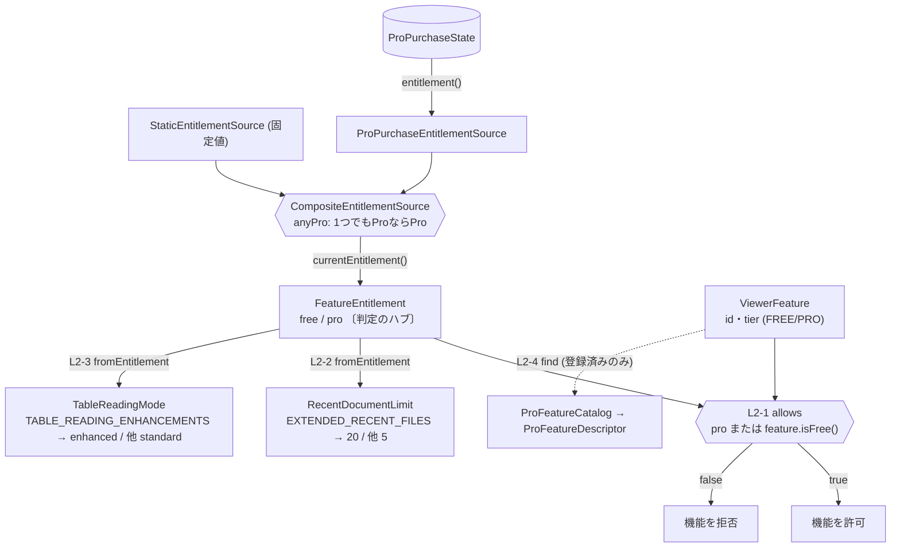

# ドメイン用語集（ユビキタス言語）

## このドキュメントの目的

LocalMD Reader のドメイン中核用語を集約し、AGENTS.md・コード・他ドキュメントで出てくる語が常に同じ意味に
解決するようにする。各用語を **構成要素・L1（語が単独で守る規則）・L2（語と語の間の規則）・L3（動作の規則）**
で記し、**各規則に「なぜ」**を添え、出典（実クラス）を明記する（憶測排除）。これがこのハブの読み方の規約。

用語はクラスタごとに分割している（1ファイルを300行以内に保つため）。
- **このファイル**: 権限（Free / Pro）クラスタ＋全体の記法・「なぜ」の方針。
- [`domain-glossary-viewer.md`](./domain-glossary-viewer.md): ビューア・ファイル（開く判定 / ドキュメント / タブ / 履歴 / 操作）。
- [`domain-glossary-navigation.md`](./domain-glossary-navigation.md): 文書ナビ・検索（見出し / 目次 / スクロール / 検索）。
- [`domain-glossary-rendering.md`](./domain-glossary-rendering.md): 描画・スタイル（書式 / コードハイライト / Mermaid）。
- [`domain-glossary-appearance.md`](./domain-glossary-appearance.md): 外観・言語（テーマ / 配色 / 文字サイズ / UI言語・文言）。
- [`domain-glossary-purchase.md`](./domain-glossary-purchase.md): Pro購入フロー（課金フロー / 購入結果 / UI状態 / Play Billing 境界）。
- [`domain-glossary-gestures.md`](./domain-glossary-gestures.md): ジェスチャ詳細（経路認識 / カスタム図形 / 割り当て集合）。

### 対象範囲（どの層の語を載せるか）

- **対象**: `domain` / `viewer` / `file` の **Android非依存なドメイン型**（ユビキタス言語）。
- **対象外**: `presentation` 層の Android UI（メニュー・ボタン・ダイアログ・View）。これらは
  「ドメイン概念をUIに描画したもの」で、語彙そのものではない。UIが表出する**意味**は対応するドメイン語で表す
  （例: 目次ボタン→`TableOfContentsItem`、検索バー→`DocumentSearchQuery/Session`、ジェスチャ動作→`GestureShortcutAction`）。
- **未収録**: 中核ドメイン語（`domain` / `viewer` / `file`）は7クラスタで一巡した。`MarkdownDraftFileName` /
  `FileInfo` など、上記クラスタに属さない少数の補助型は必要に応じて追記する（沈黙の切り捨てを避けるため、
  網羅は「主要概念は7クラスタで尽くした、周辺の補助型は逐次」という状態であることを明示する）。

パッケージ接頭辞は `io.github.yosk.mdlite`。`domain/Xxx.java` のように相対表記する。レイヤー構成は
[`../../AGENTS.md`](../../AGENTS.md) と [`architecture-package-policy.md`](../product/architecture-package-policy.md) を参照。

> 記法: 「構成要素」=保持するフィールド（`名前: 型`）。`{A, B}` は取り得る値の集合。値オブジェクトは原則
> イミュータブル（更新は新インスタンス生成）。3階層モデルの詳細は直下のエンタイトルメント節を範例とする。

---

## エンタイトルメント（Free / Pro の権限判定）— ルール3階層モデル

> **L1**: 語が単独で守るルール（構築の不変条件）／**L2**: 語と語の間で守るルール（関係・ポリシー）／
> **L3**: 動作が守るルール（操作の事前/事後条件）で記す。L3 は L1 を保ち L2 を実現する**帰結**であり、
> 独自ルールを増やさない。この記法は各クラスタ文書でも同じ規約として使う。

Free/Pro分岐は `if (BuildConfig.PRO_FEATURES_ENABLED)` のような直接分岐ではなく、以下の型で表現する
（[`free-pro-feature-policy.ja.md`](../product/free-pro-feature-policy.ja.md) 参照）。中心は1つの関係ルール
「権限(FeatureEntitlement)が機能(ViewerFeature)を許すか」。

### 判定の流れ（全体像）

供給源(EntitlementSource)が `FeatureEntitlement` を1つ生み、それが**判定のハブ**になって各派生ルール
（許可・履歴上限・表モード）と提示ゲート(Catalog)へ分かれる。番号は下の L2 ルールに対応する。

### 語の定義（構成要素 と L1: その語が単独で守るルール）

> **「なぜ」の方針（L1・L2 共通）**: すべての規則に「なぜ」を付す（一貫性のため省略しない）。再発する理由は
> 言葉で簡潔に示す——**不正状態を構築不能にする（AlwaysValid）**、**null・不明入力でも壊さず安全側（Free）に
> 倒す（fail-closed。L2-7 と同根）**。固有の理由は文で書く。**規則を持たない純粋なデータ**（提示用・情報用）には
> 「規則なし」と明記し、規則が L2 にある語は「規則→L2-x」を指す（省略と区別する）。

> **分類と「支える判断」（L2に付す）**: 各 L2 ルールに `分類` と `支える判断`（そのルールが守っている意思決定）を
> 添える。これにより読者は実装を読む前に「なぜ守るべきか」を判断できる。分類は5つ
> （[`documentation-domain-knowledge-todo.md`](./documentation-domain-knowledge-todo.md) の Classification Guide に対応）:
> **business**（価格・Free/Pro境界・購入価値・公開リポ方針）/ **safety**（プライバシー・オフライン・権限制限・fail-closed）/
> **quality**（TDD・テストスメル・行数・アーキ制約）/ **operation**（Play Console・CI/CD・リリース・署名・ブランチ保護）/
> **UX**（読みやすさ・操作速度に関わる利用者可視の振る舞い）。

- **ViewerFeature**（`domain/ViewerFeature.java`）: ビューアーが提供する個々の機能。
  - 構成要素: `id: String`、`tier: {FREE, PRO}`
  - L1: `id` は一意（`fromId` は未知idで例外）。各機能は FREE / PRO のいずれか。全インスタンスは定数で事前定義。
    なぜ: 機能を `id` で一意に識別・復元し、未知 id を黙って通さず明示失敗させる。機能集合は固定。
  - 操作: `isFree()`、`id()`、`values()`、`fromId(id)`。新機能の追加はここへの登録が起点。
- **FeatureEntitlement**（`domain/FeatureEntitlement.java`）: 利用者が現在持つ権限。
  - 構成要素: `pro: boolean`
  - L1: 状態は `free()` / `pro()` の2値のみ。生成はファクトリ経由。 なぜ: 不正状態を構築不能にする（AlwaysValid）。
  - 操作: `isPro()`、`allows(ViewerFeature)`。
- **EntitlementSource**（`domain/EntitlementSource.java`）: 権限の供給源（インターフェース）。
  - L1（規約）: `currentEntitlement()` は常に非null の `FeatureEntitlement` を返す。 なぜ: 常に非nullを返し、呼び出し側に null 分岐を強いない。
  - 実装は以下3つ（合成・導出ルールは L2 を参照）。
- **StaticEntitlementSource**（`domain/StaticEntitlementSource.java`）: 固定値を返す供給源（テスト・既定用）。
  - 構成要素: `entitlement: FeatureEntitlement`
  - L1: 生成は `free()` / `pro()` / `of(e)`。`of(null)` は Free にフォールバック（非nullを保証）。
    なぜ: 不明入力を最小権限の Free に倒す安全既定（fail-closed）。
- **ProPurchaseEntitlementSource**（`domain/ProPurchaseEntitlementSource.java`）: 購入状態から権限を導く供給源。
  - 構成要素: `purchaseState: ProPurchaseState`
  - L1: `from(state)` は `state` 非null必須。`currentEntitlement()` は `state.entitlement()` に委譲（規則→L2-6/7）。
    なぜ: 購入状態なしでは権限を導けない前提を構築時に強制（AlwaysValid）。
- **CompositeEntitlementSource**（`domain/CompositeEntitlementSource.java`）: 複数供給源を合成する供給源。
  - 構成要素: `sources: EntitlementSource[]`
  - L1: 生成は `anyPro(sources...)`。 規則→L2-5（語間ルールに集約。なぜも L2-5）。
- **ProPurchaseState**（`domain/ProPurchaseState.java`）: Pro購入の状態。
  - 構成要素: `value: {purchased, not_purchased, pending, unknown, billing_unavailable}`（5状態）
  - L1: 各状態はファクトリで生成。`fromPersistenceCode(code)` は永続コードから復元し、未知コードは `unknown`。
    なぜ: 永続データの破損や将来の未知コードでも壊さず `unknown`（→ L2-7 で Free）に倒す（fail-closed）。
  - 操作: `entitlement()`（L2-7 の写像）、`persistenceCode()`（永続化コードへ）。
- **ProFeatureCatalog**（`domain/ProFeatureCatalog.java`）: Pro提供機能の登録簿。構成要素 `INITIAL_FEATURES:
  ProFeatureDescriptor[]`（静的）。操作 `initialFeatures()` / `find(feature)`。 規則→L2-4（登録済みのみ提示可）。
  表示文言は「ロックされた機能」ではなく、長い文書・横に広い表・関連するローカル文書群を速く快適に読むための
  利用価値として表現する。現行カタログは8つの読書快適化機能、表示中の文書をHTMLとして保存または
  Android標準印刷へ渡す`EXPORT_OPTIONS`、選択したツリー内を階層移動する`PROJECT_LIBRARY`の全10件で、
  すべてPro-tierである。
- **ProFeatureDescriptor**（`domain/ProFeatureDescriptor.java`）: Pro機能の提示情報。構成要素 `feature:
  ViewerFeature`、`title: String`、`description: String`。 規則なし（提示データ）。
- **ProProduct**（`domain/ProProduct.java`）: Play Billing 上のPro課金プロダクト。構成要素 `productId: String`。
  操作 `productId()` / `isOneTimePurchase()`。 規則なし（課金プロダクト情報）。詳細は [`play-billing-design.ja.md`](../product/play-billing-design.ja.md)。
- **RecentDocumentLimit**（`domain/RecentDocumentLimit.java`）: 履歴の表示上限。構成要素 `maxItems: int`。操作 `maxItems()`。 規則→L2-2（権限から導出）。
- **TableReadingMode**（`domain/TableReadingMode.java`）: 表の読みやすさモード。構成要素 `enhanced: boolean`。操作 `isEnhanced()`。 規則→L2-3（権限から導出）。
- **FolderBrowsingMode**（`domain/FolderBrowsingMode.java`）: フォルダー選択後の利用形態。
  Freeの`FlatFolderSelection`またはProの`ProjectFolderNavigation`のどちらかであり、権限から一意に導く。
- **FolderBrowsingAction**（`domain/FolderBrowsingAction.java`）: ライブラリ入口でユーザーが実行する動作。
  Freeの`ChooseFromFolder`またはProの`OpenProjectLibrary`であり、メニュー文言はこの型を各言語へ翻訳する。
  `ChooseFromFolder`はAndroidの選択画面へ移る前にメニューを閉じ、`OpenProjectLibrary`は
  メニュー内の常設ツリーを表示するためメニューを開いたままにする。`hasExpandableMenuTree()`は
  Freeでは偽、Proでは真を返し、ツリーの開閉動作と展開記号の表示を同じ規則から導く。
- **NavigationMenuState**（`model/NavigationMenuState.java`）: ハンバーガーメニューの操作状態。
  `Closed`と`Open`だけを持ち、`open()`と`close()`はどちらの状態から呼んでも有効な状態を返す。
  Androidのvisibilityやアニメーション値は状態判定に使わない。
- **MarkdownLibraryPanelState**（`model/MarkdownLibraryPanelState.java`）: Markdownライブラリの操作状態。
  `Unselected`、`Expanded`、`Collapsed`を区別する。選択済み状態は必ず有効な現在地と一覧を持ち、
  絞り込み条件から表示一覧を導出する。開閉しても同じ内容と条件を保持する。Viewのvisibility、入力欄、
  nullableなフィールドから状態を推測しない。
- **DocumentListDialogState**（`model/DocumentListDialogState.java`）: 文書一覧ダイアログの操作セッション。
  `Closed`、`Recent`、`Pinned`、`Folder`を区別し、同時に複数の一覧種別になる不正状態を作らない。
  項目選択と副操作を全域関数として`DocumentListCommand`へ変換する。
- **DocumentListCommand**（`model/DocumentListCommand.java`）: 文書一覧から発生する効果の型。
  `None`、`OpenDocument`、`ClearRecent`、`ClearPinned`、`ChooseAnotherFolder`を区別し、
  Androidのダイアログボタン番号やpresentationのbooleanに業務上の意味を持たせない。
- **DisclosureState**（`model/DisclosureState.java`）: メニュー内セクションの開閉状態。
  `Collapsed`と`Expanded`だけを持ち、`toggled()`はどちらの有効な状態からも有効な次状態を返す。
  設定と目次は振る舞いを共有するが、ハーネス上の操作状態とコマンドは区別する。
- **MarkdownLibraryItem**（`file/MarkdownLibraryItem.java`）: Proライブラリ内の選択対象。
  移動先である`DirectoryItem`と、開く対象である`DocumentItem`を別型として保持する。
- **MarkdownLibraryLocation**（`file/MarkdownLibraryLocation.java`）: Proライブラリの現在地。
  `RootLocation`と、必ず親を持つ`NestedLocation`からなり、`back()`はどちらでも有効な現在地を返す。
- **MarkdownLibraryPath**（`file/MarkdownLibraryPath.java`）: ルートから現在地までの非空セグメント列。
  `MarkdownLibraryLocation`の生成と同時に導出し、深い階層はルートと直近セグメントを残して表示用に省略できる。
- **MarkdownLibraryRootName**（`file/MarkdownLibraryRootName.java`）: Proライブラリのルート表示名。
  文書プロバイダーの表示名を優先し、欠損または空白なら現在の表示言語に対応したライブラリ名へ置き換える。
  フォールバック自体が空の状態は生成時に拒否する。
- **MarkdownLibraryListing**（`file/MarkdownLibraryListing.java`）: 現在地にあるディレクトリとMarkdown文書の一覧。
  未対応ファイルを除外し、URIを重複排除して、ディレクトリを文書より先に表示する。
- **MarkdownLibraryQuery**（`file/MarkdownLibraryQuery.java`）: Proライブラリの現在階層を名前で絞り込む条件。
  null・空白は全件条件となり、有効な入力は前後空白と大文字小文字を無視してファイルとフォルダーの表示名に一致する。
  `MarkdownLibraryListing.matching`は項目型と順序を変えずに一致項目だけを返す。
- **RememberedMarkdownLibrary**（`file/RememberedMarkdownLibrary.java`）: Proライブラリのルート記憶。
  `NoRememberedLibrary`と、空でないtree URIを持つ`SelectedLibrary`のどちらかであり、欠損した保存値は前者へ復元する。
- **MarkdownLibraryEntryPoint**（`file/MarkdownLibraryEntryPoint.java`）: ライブラリ操作の開始方法。
  Freeまたはルート未選択なら`ChooseFolder`、Proかつ有効なルート記憶があれば`ResumeProjectLibrary`となる。
- **MarkdownLibraryRootStore**（`file/MarkdownLibraryRootStore.java`）: ルート記憶と保存媒体の境界。
  検証済みの`SelectedLibrary`だけを保存し、URI権限失効時は`forget()`してフォルダー選択へ回復する。

### L2: 語と語の間で守るルール（この節の主役）

各ルールに「どこで守られるか・**なぜあるか**（出典）・破ると壊れるもの」を併記する。**なぜ**が分からないと、
読者は良かれと思ってルールを"修正"し設計意図を壊すため、因果を必ず残す。出典の方針は
[`free-pro-feature-policy.ja.md`](../product/free-pro-feature-policy.ja.md)（以下「方針」）。

**L2-1: Pro でない限り、free な機能しか許さない**
- 関係する語: FeatureEntitlement × ViewerFeature ／ どこで: `FeatureEntitlement.allows`（`pro || feature.isFree()`、1か所）
- なぜ: Free を機能制限版にせず「ローカルMarkdownを読む用途で実用可能」に保ち、かつ「Pro 判定を読む中心経路から
  分離する」方針（方針・原則）。**だから**判定を1か所に集約し、機能追加で分岐が散らばって食い違うのを防ぐ。
- 分類: business ／ 支える判断: Free を機能制限版にせず完整提供し、課金は上乗せのみ、という価値設計。
- 破ると: Free/Pro境界が崩れ、無料で有料機能が使える／その逆。

**L2-2: 履歴上限は権限から導出（`EXTENDED_RECENT_FILES` を許せば20、でなければ5）**
- 関係する語: FeatureEntitlement → RecentDocumentLimit ／ どこで: `RecentDocumentLimit.fromEntitlement`
- なぜ: Pro は「毎日使う人の読みやすさ・操作効率」を上乗せする方針。Free でも基本的な再読（5件）は可能にしつつ、
  繰り返し読む人の効率を Pro で上げる。**だから**上限を権限から一意に導く。
- 分類: business ／ 支える判断: 履歴件数で Free/Pro を差別化する判断。
- 破ると: Free で履歴が増える／Pro で増えない。

**L2-3: 表強調は権限から導出（`TABLE_READING_ENHANCEMENTS` を許せば enhanced）**
- 関係する語: FeatureEntitlement → TableReadingMode ／ どこで: `TableReadingMode.fromEntitlement`
- なぜ: 広い表を読みやすくする Pro 価値（読みやすさの上乗せ＝方針）。**だから**モードを権限から導く。
- 分類: business ／ 支える判断: 表の読みやすさ強化を Pro 価値にする判断。
- 破ると: 権限と表示が食い違う。

**L2-4: Pro として提示できるのは登録済み機能のみ**
- 関係する語: ProFeatureCatalog × ViewerFeature ／ どこで: `ProFeatureCatalog.find`（未登録で例外）
- なぜ: 「支援購入は Pro 以上の追加階層を作らない／純粋な支援」方針。Pro 機能を明示カタログで一元管理し、
  無秩序な機能追加・提示を防ぐ。さらに Free は基本のオフライン閲覧として成立させ、Pro は長い文書や関連文書を
  より速く快適に読む上乗せとして提示する方針を守る。**だから**カタログ外は提示不可（例外）にし、カタログ内の
  文言も利用価値ベースにする。
- 分類: business ／ 支える判断: 支援購入に追加階層を作らず、Pro機能を明示カタログで一元管理する判断。
- 破ると: 未登録機能を Pro 対象として提示してしまう。

**L2-5: 合成は「いずれか1つでも Pro なら Pro」（null source は Free 扱い）**
- 関係する語: CompositeEntitlementSource → FeatureEntitlement ／ どこで: `CompositeEntitlementSource.currentEntitlement`（`anyPro`）
- なぜ: 購入状態、ビルド種別、デバッグ用プレビューなど複数の供給源を合成しても、どれか1つが Pro を明示したなら
  Pro として扱うため。供給源追加で既存の Pro 付与を取り消さず、null や不明供給源は Free に倒して安全側を保つ。
- 分類: business ／ 支える判断: 複数供給源のいずれかが Pro を示せば Pro とする合成方針。
- 破ると: 複数供給源の OR 判定が壊れる。

**L2-6: 購入由来の権限は購入状態に委譲**
- 関係する語: ProPurchaseEntitlementSource → ProPurchaseState ／ どこで: `from(state)`（state 非null必須）＋ `currentEntitlement = state.entitlement()`
- なぜ: 購入の真偽の解釈を `ProPurchaseState` 1か所に集約するため。Source 側で再判定すると解釈が二重化し食い違う。
- 分類: quality ／ 支える判断: 購入解釈の出所を1か所に閉じるアーキテクチャ判断。
- 破ると: 購入状態と権限が乖離する。

**L2-7: 購入状態→権限は `purchased` のときだけ Pro、他は全て Free（fail-closed）**
- 関係する語: ProPurchaseState → FeatureEntitlement ／ どこで: `ProPurchaseState.entitlement`
- なぜ: プライバシー・収益保護の**安全側の既定**。`pending`・`unknown`・`billing_unavailable`（オフラインや課金不可を含む）で
  誤って Pro を解放しないため、不確実なら Free に倒す。開発・検証用の Pro プレビューは購入状態とは別の供給源で扱い、
  購入状態そのものの解釈はここに閉じ込める。
- 分類: safety ／ 支える判断: 不確実な購入状態では Pro を解放しない安全既定（プライバシー・収益保護）。
- 破ると: 未購入・保留・不明・復元失敗時に誤って Pro を付与してしまう。

**この層が最重要**: L2-1〜7 はいずれも「型ではなく特定メソッド1か所」で守られる規律ルール。アプリ各所で再実装すると
静かに食い違う。呼び出し側はこれらを**再実装せず、必ず該当メソッド/ファクトリを経由する**こと。

### L3: 動作が守るルール（L1 を保ち、L2 を実現する＝帰結）

各操作は新しい規則を持ち込まず「L1 を壊さず L2 を実現する」。操作固有の判断（防御・短絡）にも「なぜ」を付す。

- `FeatureEntitlement.allows(feature)`: L2-1 を計算するだけ。`feature == null` は例外。
  なぜ: 機能が無ければ問い自体が無効。黙って許可/拒否せず明示的に失敗させる（fail-fast）。
- `RecentDocumentLimit.fromEntitlement(e)` / `TableReadingMode.fromEntitlement(e)`: L2-2 / L2-3 を実現。`e == null` は Free 扱い。
  なぜ: 権限が不明なときは安全側の Free に倒す（fail-closed）。
- `CompositeEntitlementSource.currentEntitlement()`: L2-5 を実現。最初に見つかった Pro で確定し残りを評価しない（短絡）。
  なぜ: OR 合成は1つでも Pro が分かれば結果が確定するため、無駄な評価を避ける。
- `ProPurchaseEntitlementSource.currentEntitlement()`: L2-6 を実現。`state.entitlement()` を返すのみ。
  なぜ: 購入の解釈を `ProPurchaseState` に一元化し、二重実装による食い違いを防ぐ。

いずれも L1 を壊さず L2 を満たすだけで独自ルールを増やさない。**操作が L1/L2 で説明できない判断を含むなら、
隠れた概念のサイン**（新しい語かルールを立てるべき）。各行はそのままテスト義務になる（L1=構築の性質、
L2=関係の性質、L3=操作の事前/事後）。

---

## ビューア・ファイルの用語（別ファイル）

ドキュメント・タブ・履歴・固定・復元・操作（`SafeHtml` / `OpenDocumentTab` / `RecentDocuments` /
`PinnedDocuments` / `MarkdownFileOpenResult` / `GestureShortcut*` など）は、同じ3階層モデル（構成要素・
L1・L2・L3、各規則に「なぜ」）で [`domain-glossary-viewer.md`](./domain-glossary-viewer.md) に記載する。

> 文書を分けた理由: 1ファイルを300行以内に保つため（カテゴリ分割）。本ファイルは権限(Free/Pro)クラスタ、
> リンク先はビューア・ファイルクラスタを担当する。

---

## 関連ドキュメント

- ビューア・ファイルの用語: [`domain-glossary-viewer.md`](./domain-glossary-viewer.md)
- 文書ナビ・検索の用語: [`domain-glossary-navigation.md`](./domain-glossary-navigation.md)
- 描画・スタイルの用語: [`domain-glossary-rendering.md`](./domain-glossary-rendering.md)
- 外観・言語の用語: [`domain-glossary-appearance.md`](./domain-glossary-appearance.md)
- Pro購入フローの用語: [`domain-glossary-purchase.md`](./domain-glossary-purchase.md)
- ジェスチャ詳細の用語: [`domain-glossary-gestures.md`](./domain-glossary-gestures.md)
- 機能境界の方針: [`free-pro-feature-policy.ja.md`](../product/free-pro-feature-policy.ja.md)
- レイヤー構成: [`architecture-package-policy.md`](../product/architecture-package-policy.md)
- 課金設計: [`play-billing-design.ja.md`](../product/play-billing-design.ja.md)
- エージェント向け制約・受け入れ基準: [`../../AGENTS.md`](../../AGENTS.md)
