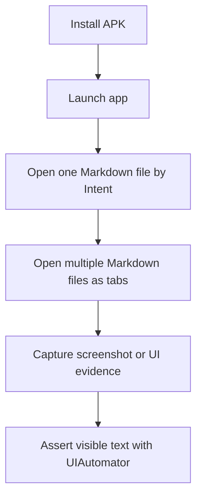

# Claude Harness Engineering Backlog

This file keeps detailed harness backlog items out of the short TODO handoff in
[`claude-harness-engineering-todo.md`](./claude-harness-engineering-todo.md).

## Build Artifact Hygiene

Goal: GitHub Actions should produce artifacts that are useful for manual verification and release preparation.

Status: complete.

Completed tasks:

- Documented where to download each artifact (CI run / Play Release run → Artifacts box) in
  `github-actions-cicd.md` ("Artifacts" section).
- Added the artifact matrix for free debug, pro preview debug, free-play release AAB, and
  pro-preview release AAB, with the `v<ver>-<code>-<sha>` name pattern.
- Confirmed name stability: the scheme is fixed and a version bump changes only the embedded
  version/code, so names are unique and predictable across versions.

Acceptance (met):

- A reviewer can open a workflow run and immediately identify which artifact to install or upload.
- Build-only workflow runs do not require Play Console credentials.

## Play Console Upload Safety

Goal: Play Console upload should be reproducible but never accidental.

Status: complete for the current free release workflow.

Follow-up tasks:

- (DONE) `scripts/play-upload-preflight.sh` validates the required GitHub variables/secrets
  (Workload Identity `GCP_*` plus the release-signing `MDLITE_RELEASE_*`) before upload. It
  runs early in the release job and only when `upload_to_play` is requested.
- (DONE) The script prints the exact missing-variable messages (it names each missing
  variable/secret, its kind, and the environment) without ever printing a value.
- Keep Gradle upload disabled until the Gradle-built AAB has been compared with the script-built AAB.

Acceptance:

- A signed AAB can be built without touching Play Console.
- Upload requires a deliberate manual workflow run and protected environment.

## Emulator Smoke Test Ladder

Goal: Add practical checks that are closer to real-device behavior without making every PR slow or flaky.

The overall placement of these large/e2e checks within the test sizes, scopes, and CI cadence is
defined in [`test-strategy.md`](./test-strategy.md). The smoke ladder is the `large` tier; it stays
manual / pre-release and is not a required PR check.

Status: implemented through L4 as a manual workflow.

Completed tasks:

- Add a script for install and launch smoke testing.
- Add a sample Markdown file for Intent-based open testing.
- Add a multiple-file Intent smoke test when single-file open is stable.

Next tasks:

- Add optional screenshot capture as an artifact, without making it a required assertion at first.
- Add UIAutomator or `adb shell uiautomator dump` checks for visible text when stable.
- Add a smoke fixture that includes a table, code block, and Mermaid block.
- Keep the workflow manual until runtime and flakiness are acceptable.

Acceptance:

- The script fails with a non-zero exit code when install or launch fails.
- The first version covers install and launch before deeper UI checks.
- The workflow is manual unless runtime is proven stable enough for PR CI.

## Release Checklist Automation

Goal: Reduce release mistakes by turning repeated manual checks into scripts or explicit checklist items.

Status: complete.

Completed tasks:

- Check version name and version code consistency.
- Check `INTERNET` permission is absent.
- Check main WebView JavaScript remains disabled.
- Check third-party notices are present for bundled assets.
- Check release notes exist for the target version.
- Check package name and flavor are explicit in release commands
  (`check_upload_package_id` and `check_gradle_flavor_ids` in `scripts/release-preflight.sh`).
- Add a release preflight command that prints a concise pass/fail summary
  (`scripts/release-preflight.sh`, merged in #43).
- Add checks for expected free/pro package IDs before artifact upload
  (free: `io.github.yosk.mdlite` in both AndroidManifest.xml and build.gradle;
  pro suffix: `.pro` in build.gradle).
- Add checks that Play upload is free-only until a real Pro product release path is approved
  (`check_free_only_upload` verifies the guard in `.github/workflows/play-release.yml`).

Acceptance:

- Release runbook points to one command or checklist for pre-upload verification.
- A missing required release document or notice fails loudly.

## Branch Protection and PR Workflow

Goal: Keep `main` protected while making normal solo development smooth.

Status: helper script exists.

Remaining tasks:

- Document required checks for `main`.
- Keep helper scripts aligned with protected-branch workflow.
- Ensure PR title validation accepts valid Conventional Commits variants.
- Avoid requiring self-approval if it blocks solo development.
- Prefer required checks and conversation resolution for mechanical protection.

Acceptance:

- A new contributor or agent can create a branch, open a PR, and know which checks must pass.
- Direct pushes to `main` are not part of the normal workflow.

## Security and Public Repository Checks

Goal: Keep the public repository safe for open development.

Status: partially complete.

Completed tasks:

- Add or maintain checks for committed secrets and keystore-like files.
- Ensure generated signing outputs are ignored when they should not be committed.
- Document safe handling of GitHub environment secrets.
- Document Workload Identity Federation as preferred over service-account JSON keys.

Remaining tasks:

- Confirm release workflows do not print secret values.
- Add a small documented checklist for reviewing public repository safety before making releases.
- Keep any service-account JSON path as legacy/manual only; prefer Workload Identity Federation.

Acceptance:

- Public repository review has a clear checklist for secrets and credentials.
- Service-account JSON keys are not required for normal CI/CD.

## Harness Evidence and Observability

Goal: Make failed CI and smoke-test runs easier to understand without requiring local reproduction first.

Tasks:

- Upload emulator logcat on smoke-test failure.
- Upload optional screenshots from smoke-test runs.
- Print package name, version name, version code, commit SHA, and build channel in each release workflow summary.
- Add GitHub Step Summary output for release and smoke workflows.
- Keep logs free of secrets and file contents that may include private user data.

Acceptance:

- A failed smoke run has enough evidence to classify the failure as install, launch, intent open, render, or crash.
- A release run summary clearly identifies the artifact and whether Play upload was skipped or executed.

## Gradle Migration Guardrails

Goal: Gradle should become the long-term build path without breaking the existing Termux-first scripts.

Tasks:

- Keep script builds as the trusted release path until Gradle release output is validated.
- Compare script-built and Gradle-built free release AAB metadata.
- Document differences between script and Gradle output.
- Add Gradle tasks only when they reduce manual release complexity.
- Do not remove Termux scripts until local development remains comfortable.

Acceptance:

- The team can explain which build path is authoritative for Play upload.
- Gradle adoption improves CI reliability without making Termux development harder.

## Medium-Tier Integration Tests (Robolectric)

Goal: Cover the thin `medium` tier — persistence round-trips, Intent open, and the reader WebView
settings — on the JVM, so the slow/flaky `large` emulator smoke is not the only place these are
checked. Rationale and the size/scope placement are in [`test-strategy.md`](./test-strategy.md).

Status: in progress — dependency and the first medium test added (CI-validated).

Done:

- Added Robolectric `4.14.1` + JUnit4 + `junit-vintage-engine` as test-only deps; enabled
  `includeAndroidResources`. Medium tests live in `src/testMedium/java`, added only to the Gradle
  `test` source set; `scripts/run-unit-tests.sh` (Termux pure-JVM runner) scans `src/test/java`
  only, so it never compiles them.
- First medium test: `ViewerSettingsStoreMediumTest` — persistence round-trips (theme / language /
  controls placement) and that a Free user does not get a Pro-only theme restored.

Tasks:

- Add Robolectric as a test-only dependency. The module uses JUnit 5 (`useJUnitPlatform()`), so add
  `junit-vintage-engine` plus JUnit4 to run Robolectric's JUnit4 runner alongside Jupiter. Pin a
  Robolectric version that supports `compileSdk 35`.
- First targets: (1) reader WebView has JavaScript disabled (behavioral guard for the Hard
  Constraint, complementing `check-hard-constraints.sh`); (2) key persistence round-trips
  (theme / font size / language / controls placement / recent / pin / restore tabs); (3) opening a
  Markdown document from an Intent.
- Run these in the `test` job (gradle). They will not run on the Termux pure-JVM runner, which is
  expected for the `medium` tier.

Acceptance:

- The WebView JavaScript-disabled rule is verified as behavior, not only by a source grep.
- Persistence and Intent open are verified without an emulator, on every PR.
- No production dependency is added; only test-scoped dependencies.

## Termux Gradle Compatibility Guardrails

Goal: Local Termux development should stay useful even when Gradle, Android SDK
platforms, or `aapt2` have device-specific compatibility issues.

Observed failure mode:

- Android SDK licenses can be accepted locally, but Gradle may still stop on Termux
  because the Maven-provided `aapt2` binary targets a different CPU architecture.
- Overriding `aapt2` with Termux's binary can get past that step, but Android 35
  resource linking may still fail while loading the SDK platform `android.jar`.
- This is an environment/toolchain compatibility issue, not evidence that product
  code or tests are broken.

Tasks:

- Document the supported local Termux path as `sh test.sh` and `sh build.sh`.
- Document that Gradle build results are authoritative in CI, not on Termux.
- Keep any Termux-only `android.aapt2FromMavenOverride` setting outside the
  repository, for example in the local user's `~/.gradle/gradle.properties`.
- Add a small diagnostic script or runbook section that classifies local Gradle
  failures as license, SDK installation, `aapt2` architecture, or platform
  resource-linking failures.
- Make PR guidance clear that local Termux Gradle failure is not a blocker when
  script tests pass and CI Gradle passes.

Acceptance:

- A developer can tell which command is expected to pass locally on Termux.
- A developer can tell which build result gates PR merge and release.
- The repository does not contain device-specific Gradle overrides that would
  break GitHub-hosted runners.

## Event-Driven Local Hooks (ECC-Inspired)

Goal: shift secret/file-size detection left of `pr-preflight.sh` (manual) to the moment of commit.

Status: complete (owner approved 2026-06-11). See
[`ecc-reference-evaluation.md`](./ecc-reference-evaluation.md) for the full evaluation,
including why an agent-neutral git pre-commit hook fits this repository better than
ECC's Claude-Code-specific hooks (both Claude Code and Codex work here).

Completed tasks:

- `.githooks/pre-commit` runs `check-no-committed-secrets.sh` and `check-file-sizes.sh`
  (~1s total; anything slower or diff-context-dependent stays in preflight/CI).
- `scripts/start-work.sh` enables `core.hooksPath .githooks` on every work-branch creation
  (idempotent); manual setup documented in AGENTS.md（作業開始時）.
