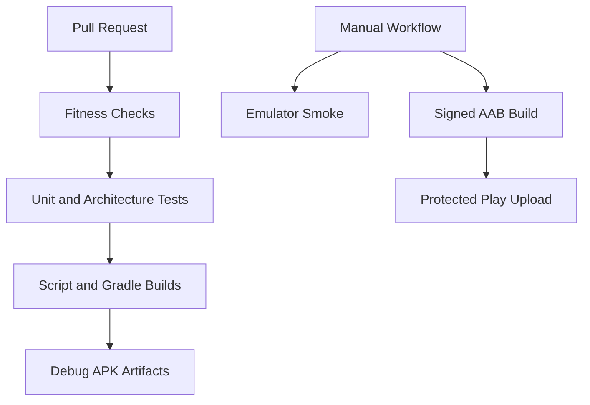

# Claude Harness Engineering TODO

## Goal

Codex should be able to focus on core product and domain implementation while Claude keeps the development harness reliable.

Harness engineering means the scripts, CI workflows, release workflow, smoke tests, and operational checks that make LocalMD Reader easier to build, verify, and release without depending on memory or manual device-specific steps.

The target state is:

- pull requests fail fast when tests, architecture rules, or build rules are broken
- debug APKs and release AABs can be produced reproducibly
- release artifacts are available from GitHub Actions
- Play Console upload is explicit, manual, and protected
- emulator smoke tests cover install and basic launch paths
- secrets, signing keys, permissions, and notices are checked before release

## Scope

Claude may work on:

- GitHub Actions workflows
- Gradle wrapper and Gradle build wiring
- shell scripts for local and CI verification
- ADB or emulator smoke-test scripts
- release runbooks and checklists
- branch protection helper scripts
- issue, milestone, and label hygiene
- security and permission checks around release artifacts

Claude must not change:

- core domain model behavior
- Free/Pro feature boundaries
- UI/UX product behavior
- Markdown rendering semantics
- Play Console production release state
- Android permissions without explicit human approval

## Hard Constraints

- Do not add `android.permission.INTERNET`.
- Do not enable JavaScript in the main WebView.
- Do not commit secrets, keystores, service-account keys, or generated credentials.
- Do not weaken test-smell checks.
- Do not bypass branch protection.
- Do not make release workflows upload to Play by default.
- Do not change app behavior inside harness-only PRs.

## Done Criteria

A harness task is complete when:

- the change is small enough to review as a focused PR
- the PR explains what failure mode the harness now catches or prevents
- local verification commands are documented
- CI verification is documented
- release-related workflows are manual or environment-protected
- artifacts are named clearly enough to distinguish free/pro and APK/AAB outputs
- any new script exits non-zero on failure
- any new test follows the project test rules

## Work Items

### Completed Initial Work

The first harness pass is complete as of `2026-06-01`.

Completed PRs:

- #31: branch protection helper
- #33: release notes check
- #34: committed secret and keystore guard
- #35: manual emulator smoke test for launch and Markdown open intents
- #118: ProPurchaseState Alloy model and domain-model-check workflow (MERGED 2026-06-07, sha: 2e37b10)

The current harness now covers:

- CI fitness checks for file size, hard constraints, and committed secrets
- unit tests, architecture checks, test-smell checks, third-party notice checks, and debug build
- Gradle debug/release build verification
- free debug and pro preview debug APK artifacts from CI
- manual Play release workflow with protected environments
- Workload Identity Federation based Play upload support
- release notes validation before release artifact creation
- emulator smoke ladder through launch, single Markdown open, and multiple Markdown tab open

### Next Work Items

The next harness work should focus on evidence quality, release confidence, and keeping product work isolated from harness work.

Detailed backlog items live in [`claude-harness-engineering-backlog.md`](./claude-harness-engineering-backlog.md). Agent-facing harness design areas, their gaps, and acceptance criteria live in [`agent-harness-design.md`](./agent-harness-design.md).

Current priority order:

1. (DONE) Artifact download guidance and an artifact matrix — `github-actions-cicd.md`
   "Artifacts" section (free/pro debug APKs, free-play/pro-preview release AABs, name pattern,
   download location, name stability).
2. (DONE) Upload preflight checks for protected Play Console workflows —
   `scripts/play-upload-preflight.sh`, wired into `play-release.yml` before the build, validates
   the Workload Identity variables and signing secrets and fails fast (without printing values).
3. (DONE) Add smoke-test evidence artifacts such as logcat and optional screenshots.
   - Implemented: `device-smoke.yml` `capture_evidence()` function collects logcat
     (`smoke-artifacts/logcat.txt`, L65) and screenshot (`smoke-artifacts/screen.png`, L66),
     uploaded via `actions/upload-artifact@v5` on every run (`if: always()`).
   - Confirmed in: `.github/workflows/device-smoke.yml` L62-80, `docs/harness/test-strategy.md` L55.
4. Add release preflight summary checks.
5. Keep Gradle migration guarded until its output is validated against the script-built release output.
6. Document Termux Gradle limitations and keep CI Gradle results authoritative when local Gradle stops on SDK or AAPT2 compatibility.
7. **Mutation testing gate for the pure logic layers (highest-priority next work).** Why: line/branch
   coverage proves code ran, not that a test would fail if logic broke — it is the missing middle of the
   project quality bar's three-layer verification (manual fault injection -> mutation testing -> PBT).
   What: PITest on the Android-free packages (`domain`/`viewer`/`file`/`infrastructure`), run on the pure
   JVM the way `run-unit-tests.sh` already compiles them (no Android SDK).
   - `scripts/run-mutation-tests.sh`: downloads PITest (+ commons-text/lang3) and the existing test jars,
     compiles the same sources as the unit runner, runs PITest CLI with the JUnit 5 plugin.
   - Mutates production only (`--excludedClasses *Test,*Tests,*Property,*Properties`): test classes share
     the production packages under `src/test/java`, so without this PITest mutates the tests themselves.
   - Excludes ArchUnit tests (structure, not behaviour) and jqwik PBT (`*Property`/`*Properties`) from the
     test run — PBT re-runs ~1000 cases per mutant and makes runs explode; example tests carry the
     detection signal here, and PBT still runs every PR in the unit job.
   - `.github/workflows/mutation.yml`: runs on every PR as a single job, but only does the analysis when
     the logic layers / their tests / the runner change (path-detected via diff), so the check never gets
     stuck pending. Report uploaded as an artifact; triage copied to the job summary.
   - Baseline (production) mutation score ~82% (test strength ~89%, ~75s) after excluding the i18n string
     table (`ViewerText*`). Gate is a ratchet floor of 79% (raised 65→68→70→72→74→79 through progressive
     example-test hardening, most recently via directional-gesture and relative-link rendering tests
     in #117). The 80% quality-bar target is met at the current score.
     Remaining gaps (per `docs/harness/mutation-analysis-rule.md`): `MarkdownHeadings` (NO_COVERAGE 31),
     `CustomGestureShape$SampledPoints` (14), `ViewerThemeStyle` (13) — fix SURVIVED first; never lower
     the floor. Floor ratchet 79→80+ is in progress (cmd_010).
     Confirmed in: `scripts/run-mutation-tests.sh` L17-31.
   - Analysis/improvement loop is a rule: `docs/harness/mutation-analysis-rule.md` — the run prints a
     SURVIVED/NO_COVERAGE triage (also `report/triage.txt`) and the CI job copies it into the GitHub job
     summary, so each PR shows the next class to harden. Fix SURVIVED first; never lower the floor.
   - Making `mutation` a required status check is a separate follow-up after this PR merges (added on the
     branch-protection side, not in this workflow-adding PR).
   - Verify locally: `sh scripts/run-mutation-tests.sh` (~75s; pure JVM, no Android SDK).

### Merged PRs (recent)

- #119: docs: add domain knowledge deepening loop design — MERGED (e5dd6a78, 2026-06-07T07:46:01Z)
- #121: test(smoke): add L5 render assert for table/code-block/Mermaid — MERGED (b1f449f, 2026-06-07T08:51:19Z)

## PR Guidance for Claude

Each PR should include:

- the harness problem being solved
- the command or workflow used to verify it
- whether the change affects local development, CI, release, or Play upload
- explicit confirmation that app behavior was not changed
- explicit confirmation that `INTERNET` permission was not added

Prefer small PRs in this order:

1. artifact naming and upload cleanup
2. release workflow safety documentation
3. install/launch smoke-test script
4. single-file Intent smoke test
5. multiple-file Intent smoke test
6. release checklist automation
7. branch protection helper updates

## Non-Goals

- Full UI automation for every feature
- Replacing manual real-device checks
- Changing product design through CI changes
- Moving all local scripts to Gradle at once
- Making Play Console publication fully automatic
