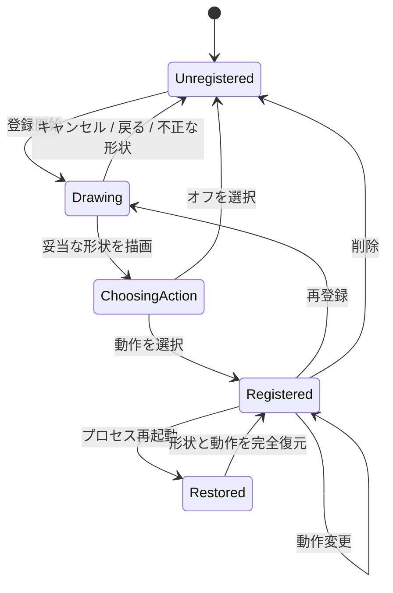

# カスタムジェスチャー探索テスト計画

## 目的

カスタムジェスチャーを「登録できる部品」ではなく、登録、復元、発火、中断まで完結する利用経路として検証する。
探索で不具合を見つけた場合は、セッションログのfindingから恒久テストへ追跡可能にする。

## 状態モデル

## 共通環境と証拠

- 対象: Pro debug APK `io.github.yosk.mdlite.pro.debug`
- 実機操作: 無線ADB。操作中は `svc power stayon true`
- 各ケースの証拠: 操作前後のUI dump、必要時のスクリーンショット、前面Activity、クラッシュログ
- 失敗時: finding IDをセッションログへ記録し、small testを第一候補、Android配線はstructure/medium testへ蒸留
- 完了条件: 各ケースが Pass / Finding / Blocked のいずれかになり、Findingは恒久テストまたは未反映理由へ対応する

## ケース

### A. 登録・復元・削除

| ID | 事前状態 | 操作 | 期待結果 | 主な証拠 | 失敗時のテスト候補 |
|---|---|---|---|---|---|
| CG-A01 | 未登録 | 形状を描き「検索バーを表示」を割り当て、同じ形状を描く | 一覧が更新され、検索バーが開く | 一覧と検索バーのUI dump | shortcut保存とhandlerのmedium test |
| CG-A02 | CG-A01完了 | force-stop、起動、同じ形状を描く | 復元した動作で検索バーが開く | 再起動後の一覧・検索バー | restore→handler結合テスト |
| CG-A03 | 登録済み | 削除、force-stop、起動、旧形状を描く | 一覧はオフ、検索バーは開かない | 一覧・操作後UI dump | clear後のbinding不在テスト |
| CG-A04 | 登録済み | 動作だけを別動作へ変更、再起動 | 形状は維持され新動作だけ発火 | 一覧・動作結果 | shape保持とaction置換テスト |

### B. ライフサイクルと中断

| ID | 事前状態 | 操作 | 期待結果 | 主な証拠 | 失敗時のテスト候補 |
|---|---|---|---|---|---|
| CG-B01 | 描画中 | 画面上のキャンセルを押す | Activityを維持して閲覧画面へ戻り、設定を変更しない | 前面Activity・UI dump | cancel target small + wiring test |
| CG-B02 | 描画中 | 端末の戻るを実行 | Activityを維持して閲覧画面へ戻り、設定を変更しない | 前面Activity・UI dump | modern back wiring test |
| CG-B03 | 描画中 | ホームへ移動しアプリへ戻る | 描画セッションを継続し、案内とキャンセルを操作できる | 復帰後スクリーンショット | lifecycle medium test |
| CG-B04 | 描画中 | 端末を回転 | クラッシュせず描画を安全に中断し、既存登録を維持する | 回転後UI・一覧 | recreation state test |
| CG-B05 | 描画中 | force-stopして起動 | 部分形状を復元せず、既存登録を維持する | 起動後一覧 | pending state非永続化テスト |
| CG-B06 | 動作選択中 | force-stopして起動 | 保留形状を登録せず、既存登録を維持する | 起動後一覧 | pending action非永続化テスト |

### C. 認識競合と誤発火

| ID | 事前状態 | 操作 | 期待結果 | 主な証拠 | 失敗時のテスト候補 |
|---|---|---|---|---|---|
| CG-C01 | 登録済み | 同形状を位置と大きさを変えて描く | カスタム動作が発火する | 動作結果 | matcher property test |
| CG-C02 | 方向形状に近いカスタムを登録 | 登録形状を描く | custom→directionalの優先順でカスタム動作だけ発火 | 動作結果 | handler precedence test |
| CG-C03 | 円に近いカスタムを登録 | 登録形状を描く | custom→circleの優先順でカスタム動作だけ発火 | 動作結果 | handler precedence test |
| CG-C04 | カスタム登録済み | 通常の縦スクロールを繰り返す | カスタム動作が誤発火しない | 検索バー等が非表示 | negative matcher examples |
| CG-C05 | カスタム登録済み | 明確に異なる形状を描く | カスタム動作が発火しない | 動作非発火 | matcher negative property |

### D. 表示とアクセシビリティ

| ID | 事前状態 | 操作 | 期待結果 | 主な証拠 | 失敗時のテスト候補 |
|---|---|---|---|---|---|
| CG-D01 | 日本語 / 英語 | 登録画面を開く | 案内とキャンセルが同一言語でシステム領域と重ならない | 両言語スクリーンショット | localized composition test |
| CG-D02 | 各Proテーマ | 一覧と登録画面を開く | 線、点、文字、背景に十分なコントラストがある | テーマ別スクリーンショット | palette contrast test |
| CG-D03 | TalkBack相当のUI dump | 登録画面を確認 | 描画面とキャンセル操作を識別できる | content-desc / node | accessibility structure test |

## 実行順

1. A: 利用価値の中心である再起動後の実発火を確定する。
2. B: 部分状態が残りやすいライフサイクル境界を確認する。
3. C: 通常スクロールとの競合を優先してから形状間競合へ進む。
4. D: 日英とテーマの組み合わせを確認する。

停止基準は各群で2ケース連続Findingなし。ただしBlockedはFindingなしに数えない。

