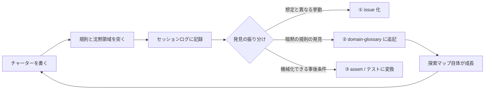

# 探索テストセッションの運用ルール

## このドキュメントの目的

スクリプト化された assert は「既知の期待」しか守れない。issue #97 では「OPEN_TEXTS が成功すれば
fixture タブがアクティブになる」という事後条件が**誰にも言語化されておらず**、撮影ハーネスが緑のまま
嘘の証拠を保存し続けた。これを見つけたのは assert ではなく、緑 run の成果物の目視＝探索だった。

このドキュメントは、その探索を場当たりでなく**定常のハーネス活動**として回すための運用ルールを定める。
読者（人間または AI エージェント）は、このルールに従ってチャーターを書き、探索を実施し、
発見を3方向（issue / 用語集 / assert）に振り分けられるようになる。



## 原則

1. **探索はマージゲートにしない**。探索は発見のための活動で再現性がない。ゲート化するのは
   探索が見つけた事後条件の assert の方（混ぜると CI が flaky になる）。
2. **チャーター必須**。1セッション1チャーター（1観点）。チャーターの無い探索は徘徊になる。
3. **観測のみを記録する**。憶測でセッションログを埋めない。確認できなかったことは
   「未確認（確認には○○が必要）」と書く。
4. **発見ゼロも成果**。「この範囲は規則どおりだった」という記録は、停止基準（後述）の入力になる。

## チャーターの書き方

| 項目 | 内容 | 例 |
|------|------|-----|
| 対象 | 用語集のクラスタ（または規則 ID） | 外観クラスタ（domain-glossary-appearance.md） |
| 観点 | 何を疑うか | L1/L2 規則の境界値・規則が沈黙している操作の挙動 |
| 動機 | なぜ今この範囲か（リスク信号） | 次の視覚 PR（#72）がテーマ追加を触るため |
| タイムボックス | 探索の上限 | probe 20 本 or 60 分 |

## 探索範囲のマップと拡張戦略

探索範囲の全体集合は `docs/domain/domain-glossary*.md`（7クラスタ・全70クラス・L1/L2/L3 規則）。

```
探索範囲 = クラスタ × 規則の種類
  - L1/L2 規則         → 規則どおりかを境界値で突く
  - 「規則なし」の箇所  → 本当に規則が無いのかを問う（負の空間、発見が出やすい）
  - 規則が沈黙する操作  → 未文書化の挙動（例: light/dark 以外のテーマの toggled()）
```

**拡張の順序**: 単軸のライフサイクル境界 → 状態を共有する2軸の相互作用
（SharedPreferences のキーを共有する組を優先）→ 負の空間・外部入力（壊れた Markdown、想定外 URI）。

**優先順位付けの信号**: mutation の SURVIVED/NO_COVERAGE が集中するクラス、直近 PR の変更
ホットスポット、過去の発見実績（欠陥はクラスタする）。

**停止基準**: 同一チャーターで2回連続発見ゼロなら次のクラスタへ（loop-until-dry）。
発見率が落ちたら次の層（単軸→相互作用→負の空間）へ移る。

## 実施手順

1. チャーターを書く（上の表の4項目）。
2. 対象クラスタの用語集を読み、規則の一覧と「沈黙領域」（規則が言及しない操作・境界・組み合わせ）を列挙する。
3. probe を実施する。実行環境は対象で使い分ける:
   - **domain / viewer / file 層**: 純 JVM の scratch コード（Android 不要、ローカルで数秒）。
   - **presentation 層・画面の振る舞い**: CI エミュレータの専用装置 `exploration-emulator.yml`
     （workflow_dispatch・非ゲート・1 run ≈ 15分。チャーターを絞ってから使う）。2モード:
     **monkey**（シード付きランダムUIイベント。crash/ANR の unknown unknowns 発見。シードをログに記録すれば再現可能）／
     **ops**（チャーターから書き起こした操作列 `scripts/exploration-ops/*.ops` を実行し、
     各ステップのスクリーンショット + UI ダンプを自動採取→artifact を分析）。
     ops ファイルは probe と同じ足場扱い: セッション固有のものはセッション後に削除してよい
     （example.ops のみ語彙の見本として常置）。
   - **緑 run の成果物検証**: 既存 workflow の artifact を目視（#97 を見つけた方法）。
4. 観測をセッションログに記録する（様式は次節）。
5. 発見を3方向に振り分ける（振り分け基準は次々節）。

## セッションログの記録様式

`docs/harness/exploration-sessions/YYYY-MM-DD-<対象>.md` に1セッション1ファイルで残す（300行以内）。

```markdown
# 探索セッション: <対象> (YYYY-MM-DD)
## チャーター
対象 / 観点 / 動機 / タイムボックス
## probe と観測
| # | 突いた規則(または沈黙領域) | probe | 観測 | 判定 | 振り分け |
## 振り分けの結果
①issue: ... ②glossary: ... ③assert: ...（それぞれリンク）
## 次のチャーター候補
（このセッションで見えた未探索領域）
```

「判定」は3値: **規則どおり** / **規則と異なる** / **規則が沈黙**（文書に記述が無い）。

## 発見の振り分け基準

| 発見の種類 | 行き先 | 判断基準 |
|-----------|--------|---------|
| 規則と実挙動が**異なる** | ① issue | 実害の有無は issue 上で判断（用語集が誤っている可能性も含めて起票） |
| 規則が**沈黙**しているが実挙動に意図が読める | ② glossary 追記 | 「なぜ」を実装コメント・PR 履歴から裏取りして L2/L3 規則として明文化。裏取り不能なら「未確認」付きで追記 |
| 規則どおりだが**テストが無い**（mutation の NO_COVERAGE 等で確認） | ③ テスト追加 | 自己文書化テストとして性質を固定 |
| ハーネスの事後条件の欠落（#97 型） | ③ assert 追加 | 「写っているべきものが写っているか」を assert に変換 |

②が最重要: 用語集は AI エージェントのコンテキストとして毎セッション読み込まれるため、
探索の発見を用語集に還元すると知識が複利で効く。assert だけ足して知識を文書化しないと
「なぜその assert があるのか」が次の作業者に伝わらず劣化する。

## 継続ループ（開発ループへの組み込み）

**なぜ**: 探索が単発だと、トリガーが「人の思いつき」任せになり回数が安定しない（運用ルール策定後の
実施は2セッションのみ）。セッション#1は probe 11本で発見6件・issue 1件という高い発見率を出したのに、
「次をいつ・どこで回すか」が決まっていないため知識獲得が偶発に留まる。

**だから**: トリガー・次対象の選定・価値評価を仕組み化し、AIエージェントが開発ループの中で
自律的に探索を回し、その価値を自分で評価・報告できるようにする。

### トリガー（いつ探索するか）

| # | トリガー | なぜそのタイミングか |
|---|---------|-------------------|
| T1 | 機能PRの完了後、触れたクラスタに対して | 変更直後は仕様の沈黙領域が増えるタイミングで、欠陥はクラスタする（変更ホットスポット＝発見ホットスポット） |
| T2 | `scripts/exploration-status.sh` のシグナル（★）検出時 | 「変更が集中しているのに未探索/陳腐化」は探索価値が最も高い交差点 |
| T3 | 大きな機能追加の設計前、対象クラスタに対して | 規則の沈黙領域を着工前に洗うと手戻りが減る（#72 前にセッション#1を実施した前例） |

T1/T3 は提案ベース（エージェントがチャーター候補を提示し、実施判断はオーナー）。
探索自体は引き続きマージゲートにしない（原則1）。

### 自己操縦（次にどこを探索するか）

`sh scripts/exploration-status.sh` が以下をセッションログと git 履歴から集計し、
チャーター候補の根拠を提示する:

1. セッション台帳（probe数・発見数・振り分け実績）
2. クラスタカバレッジ（最終探索日・未探索クラスタ）
3. 直近30日の変更ホットスポットとクラスタ推定
4. シグナル: 未探索×ホットスポット交差（★）／2回連続発見ゼロ（停止基準該当 ■）

エージェントはシグナルからチャーター（対象/観点/動機/タイムボックス）を起案する。
シグナルは advisory であり、最終的な対象選定とタイムボックスはチャーターを書く者が決める。

### セッションの自己評価（価値の記録）

各セッションログの末尾に機械可読フッターを必ず記録する（`exploration-status.sh` が集計）:

```markdown
## 価値評価（機械可読・集計は scripts/exploration-status.sh）

- probes: 11            # 実施した probe 数
- findings: 6           # 判定が「規則と異なる」または「規則が沈黙」の probe 数
- triage-issue: 1       # ① issue 化した件数
- triage-glossary: 5    # ② glossary に追記した件数
- triage-assert: 1      # ③ assert / テストに変換した件数
- time-minutes: 45      # 所要時間（概算）
```

数値は本文の probe 表・振り分け節から導出できるものだけを書く（憶測禁止）。
未実施の triage は 0 と書き、理由を本文に残す。

### 探索成果物のライフサイクル（ピラミッドを崩さない）

**なぜ**: 探索は学び（unknown unknowns の発見）のための活動で、探索由来のテストが堆積すると
テストピラミッドが崩れる（オーナー方針 2026-06-12）。**だから**「探索は足場、堆積するのは蒸留物」を原則とし、
成果物ごとにライフサイクルを定める:

| 成果物 | ピラミッドへの影響 | ライフサイクル |
|--------|------------------|---------------|
| probe（scratch コード） | なし | **コミットしない**。セッション終了で破棄（再現が要る観測はログに入力値を記す） |
| セッションログ | なし（文書） | 永続。知識の台帳・ループ評価の入力 |
| 蒸留された例テスト（small/medium） | 正規市民として堆積 | 恒久。これがハーネス本体 |
| **探索用ステートフル PBT**（操作列の生成器） | 重い（生成型・毎PR実行） | **発見した反例をすべて例テスト化し終えたら退役（削除）**。削除は理由つきで記録する（silent 削除禁止） |
| 守備用 PBT（AlwaysValid 不変条件の固定） | 有界・高速 | 探索とは別物。回帰ガードとして残す |
| 探索目的のエミュレータ probe | 高コスト | 下層（small/medium）で同じ欠陥クラスを検出可能になったら削除＝ROI評価の removal 判定（独自検出ゼロ）に接続 |

機械ガード: ピラミッド比率は `test-balance-report.sh --strict` が監視しており、
この原則が破られて探索由来テストが堆積し始めれば比率逸脱として検知される。

### ループ自体の評価と撤去基準（メタハーネス）

探索は**検知型**のハーネス層であり、発火実績で評価できる。ただし「発見ゼロ＝無駄」ではない:
セッション#2 は発見1件（probe 21本）だったが、残り20本の「規則どおり」は
**安全境界が堅牢であるという肯定的証拠**で、これも成果である（原則4）。

評価は次の2層で行う:

| 層 | 評価軸 | 判断 |
|----|--------|------|
| セッション単位 | findings と triage の実績（フッター） | 2回連続発見ゼロ → 同一クラスタを離れ、次のクラスタ or 次の層（単軸→相互作用→負の空間）へ |
| ループ全体 | 累積の知識還元（triage-glossary + triage-issue + triage-assert の合計） | 直近3セッション連続で知識還元ゼロなら、ループの縮小（頻度/タイムボックス削減）を提案し、次回ハーネスROI評価（[harness-roi-framework.md](./harness-roi-framework.md)）の判定対象に載せる |

実績データなしに常設・撤去を判断しない（メタハーネス原則）。次回ROI評価では本ループを
評価対象層に追加し、コスト（人手時間・トークン・実行時間）と発見率を他層と同じ基準で判定する。

### ドメイン知識深化ループとの関係

本ループは [domain-knowledge-loop.md](./domain-knowledge-loop.md) の S1（探索）の常設運転にあたる。
発見のうち「意図/欠陥」の分類が必要なもの（観測挙動の正典化）は、S2 分類ゲート＝オーナー裁可を
必ず経由する。探索→裁可→仕様化→二重反映の下流工程は同文書の定義に従う。

## 関連

- 発端と設計議論: issue #100 ／ 実例 #97（緑 run の証拠欠落）
- 探索が前提とするマップ: [`docs/domain/domain-glossary.md`](../domain/domain-glossary.md)（ハブ）
- ハーネス全体の設計: [`docs/agent-harness-design.md`](../agent-harness-design.md)
- 探索状況の集計: `scripts/exploration-status.sh`（本書「継続ループ」節）
