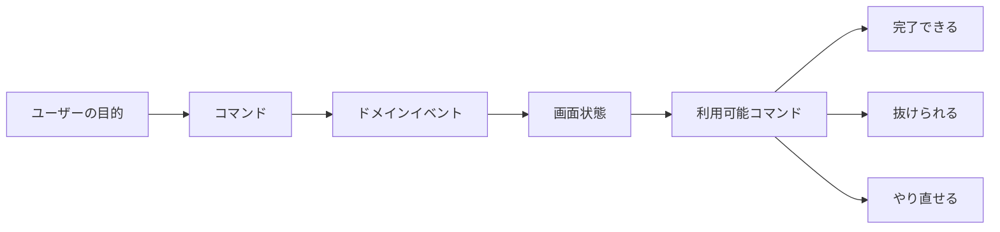
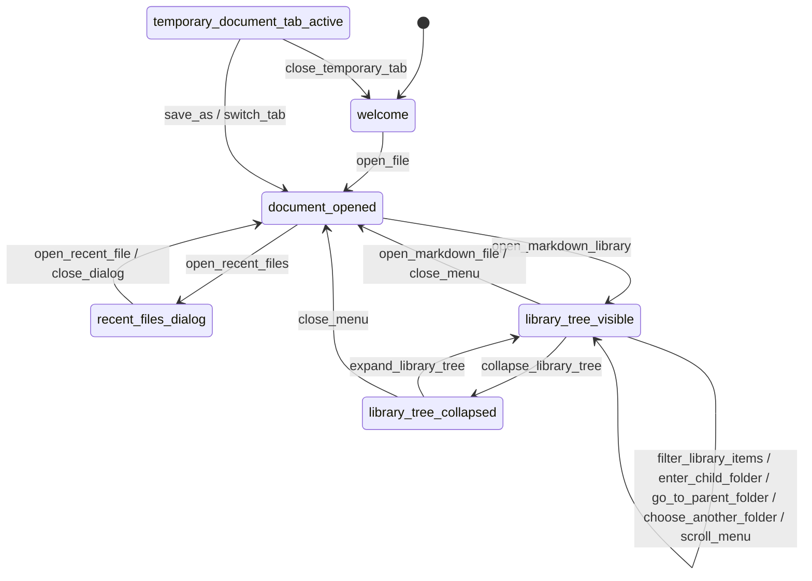

# Interaction Storming Guard

## 目的

イベントストーミングは「ユーザーの目的」から画面状態を追うのに向いている。LocalMD Reader では、
最近開いたファイルのダイアログに閉じる手段がない、Markdown ライブラリで別フォルダを選び直せない、
といった **操作の流れが完結しない欠陥** が実機フィードバックで見つかった。

この欠陥は表示崩れではなく、状態に対して必要なコマンドが欠ける問題である。そこで、探索前に
イベント列を「状態」と「その状態で利用可能であるべきコマンド」に落とし、静的に抜け漏れを検査する。

## 検査する性質

`docs/harness/interaction-storming-flows.psv` に、探索対象の状態を記録する。各状態は次を満たす。

| 性質 | 意味 |
|------|------|
| completion | ユーザー目的を完了するコマンドがある |
| escape | 目的を中断して状態から抜けるコマンドがある |
| recovery | 間違った入力や別経路に戻るコマンドがある |
| evidence | 実装または仕様文書に対応する根拠がある |

この検査は「ボタンの見た目」ではなく「あるべき操作の存在」を見る。UI 自動操作で全画面を歩く前に、
そもそも状態モデル上の出口が欠けていないかを早く検出するためのガードである。

## 有限状態モデル

操作の存在だけでは「押した後にどこへ進むか」は検査できない。そこで次の2ファイルで有限状態モデルを
持つ。

| ファイル | 内容 |
|----------|------|
| `docs/harness/interaction-model-states.psv` | 画面状態、安定状態か一時状態か、外部入力の root か、根拠 |
| `docs/harness/interaction-model-transitions.psv` | 状態からコマンドを実行した後の遷移先 |
| `docs/harness/interaction-model-surfaces.psv` | 実装上のUI surface、対応する状態、実装識別子 |
| `docs/harness/interaction-command-contracts.psv` | 高リスク操作、実装入口、動作テストの追跡契約 |

`sh scripts/check-interaction-model.sh` は次を検査する。

1. flow 表の completion / escape / recovery コマンドに対応する遷移が存在する。
2. flow 表の available_commands に listed された全コマンドに対応する遷移が存在する。
3. 遷移元・遷移先がすべて既知の状態である。
4. すべての状態が root 状態から到達できる。
5. すべての状態が有限回の操作で stable 状態へ戻れる。
6. overlay 状態は stable 状態へ直接抜ける遷移を持つ。
7. 台帳化した UI surface は必ず既知の状態に対応する。
8. 非 stable 状態は必ず flow 表に載り、完了・脱出・回復の操作を持つ。
9. すべての状態は UI surface 台帳に対応する。
10. UI surface 台帳の evidence は実在する実装または仕様ファイルを指す。
11. 同じ状態・同じコマンドの遷移は一意であり、操作結果が競合しない。
12. UI surface の locator は evidence ファイル内に実在し、根拠がファイル名だけにならない。
13. 選択肢・複数選択・カスタムViewを持つAndroidダイアログは、直前の`interaction-surface`
    マーカーで台帳上のsurface IDを宣言する。
14. 追跡対象コマンドは、モデル遷移、`interaction-command`実装マーカー、実装locator、
    動作テストlocatorのすべてを持つ。
15. 実装マーカーだけが追加され、対応表やモデルに登録されていない操作を許可しない。

`sh scripts/check-interaction-command-traceability.sh` は、状態モデルだけが正しく実装が欠ける
「賢いモデル、無防備な実装」を防ぐ。ファイルの存在だけでは根拠とせず、実装メソッド名と
自己文書化された動作テスト名が各ファイル内に残っていることまで照合する。

## 運用

1. ユーザーから操作不能・戻れない・選び直せないフィードバックが出たら、まず対象状態を表に追加する。
2. `sh scripts/check-interaction-storming.sh` を実行し、完了・脱出・回復・根拠の欠落を検出する。
3. `sh scripts/check-interaction-model.sh` を実行し、コマンドに対応する遷移と stable 状態への復帰可能性を検出する。
4. `sh scripts/check-interaction-command-traceability.sh` でモデル・実装・動作テストの対応を検証する。
5. 欠落していたコマンドを実装したら、状態、遷移、実装マーカー、動作テスト、対応表を同時に更新する。
6. 探索で見つかった実例は `docs/harness/exploration-sessions/` に残し、再発防止はこの表か通常のテストに蒸留する。

探索セッション自体はゲートにしない。一方、この表の整合性は仕様の抜け漏れ検査なので
`pr-preflight` と CI の fitness job に含める。

## 現在の重点フロー

| フロー | 欠陥として見つけたいこと |
|--------|--------------------------|
| recent-files | ダイアログを閉じられない、履歴から開けない、履歴を整理できない |
| markdown-library | 絞り込みを解除できない、フォルダを選び直せない、上位階層に戻れない、ファイルを開けない |
| pinned-files | ピンを個別解除できない、閉じたタブとの状態が矛盾する |
| temporary-documents | 一時文書を保存した後に古い一時タブが残る、保存や破棄ができない |
| external-open | 他アプリから開いたファイルがセッションに残らない、前のファイルを失う |
