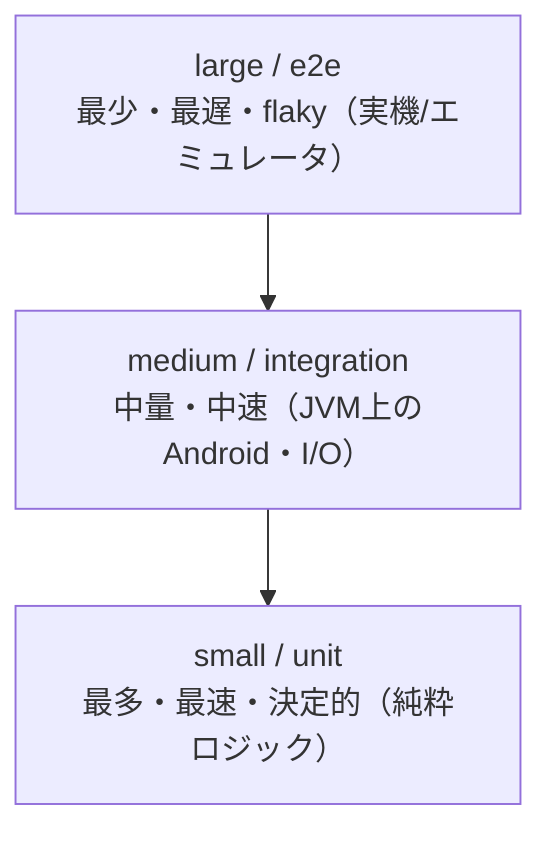

# テスト戦略

## このドキュメントの目的

「何を・どの粒度で・どこで・どれくらいの頻度で確認するか」を1か所に定める。t-wada 氏の整理に倣い、
**テストサイズ**（速度・決定性の軸）と**テストスコープ**（対象の広さの軸）を分けて考え、ピラミッドを基調に
CI/CD への割り付けまでを決める。

## 2つの直交する軸

混同しがちだが、サイズとスコープは別物（直交する）。

- **テストサイズ（Google 由来: small / medium / large）** — リソースと隔離で決まり、**速度・決定性・並列性**を担保する。
  - **small**: 単一プロセス、I/O 禁止（network / disk / DB）、`sleep` 禁止、決定的・最速・並列可。
  - **medium**: 単一マシン、localhost 通信・ローカル DB・ファイル I/O 可。中速、多少の flaky を許容。
  - **large**: 複数マシン／実機・エミュレータ／実外部システム。最遅・flaky 前提。
- **テストスコープ（unit / integration / e2e）** — 対象の広さ（設計の軸）。

例（直交）: 実 `.md` を読んで `FileTypeDetector` を試すのは「スコープ=unit、サイズ=medium」。エミュレータ起動は
「e2e × large」。**「unit=小さい / e2e=大きい」は必ずしも一致しない。**

## ピラミッドとトレードオフ

下ほど**多く・速く・安定**、上ほど**少なく・遅く・不安定**。これは**忠実性（本番への近さ）と 速度・決定性 の
トレードオフ**。原則は「**速くて決定的なものを多く・頻繁に。遅くて不安定なものは最小限・低頻度**」。本プロジェクトは
ロジックを Android 非依存の純粋層（`domain` 等）へ寄せているため、ピラミッド基調が妥当（底を厚くできる）。

## 目標バランス（件数でなく比率で見る）

絶対件数は陳腐化し、健全性をほとんど語らない。代わりに**サイズ比率**を目安バンドとして持ち、ピラミッドが
崩れていないかを検知する。`scripts/test-balance-report.sh` で集計する（`--strict` でバンド逸脱を非ゼロ終了）。

| サイズ | 目安比率 | 何が入るか |
|---|---|---|
| small | **70〜90%** | 純粋ロジック（`domain` / `viewer` / `infrastructure` / `file`）・ArchUnit・PBT |
| medium | **10〜25%** | Robolectric（JVM 上 Android）・ファイル I/O 等 |
| large | **1〜10%** | 計装テスト＋emulator スモーク |

**large は比率より「存在すること」と「リリース前に実行されること」が重要**（数や割合が小さくてもよい）。

## 現状の傾向

| サイズ | 状態 |
|---|---|
| small | **過多**（純粋層に寄せた結果。バンド上限を超える＝裏返せば medium が不足）。`domain` を Android 非依存にした強みでもある |
| medium | **不足**（ほぼ無い）。永続化・Intent・WebView 束縛の結合確認を large smoke が肩代わり |
| large | スモークが存在し手動／pre-release で実行（L1–L4 の起動・Intent・no-crash に加え、**L5 描画アサート（表/コード/Mermaid）は PR #121 (b1f449f) でマージ済み・実装済み**）。logcat + screenshot 証跡を artifact 化済み |

**構造的弱点**: small に偏り **medium 層が薄い**。永続化や Intent/WebView の結合確認を「遅く・flaky・手動」の
large smoke だけに頼っている → medium を増やして「下へ押し下げる」（後述の Robolectric）。最新の比率は
`scripts/test-balance-report.sh` を実行して確認する。

## 各層で何を確認するか（重複させない）

- **small / unit**: ドメイン規則（不変条件・L2 ルール・操作契約）、値オブジェクト、ポリシー、Markdown 整形ロジック、
  ArchUnit（レイヤ依存）、PBT（不変条件）。**ロジックはここで尽くす。**
- **medium / integration**: 純粋層だけでは確認できない「結合」。永続化の往復（保存→復元）、Intent からの文書オープン、
  reader WebView の設定（**JS 無効＝Hard Constraint**）、実ファイルの種別/サイズ判定。
- **large / e2e**: 利用者視点の通し（インストール→起動→Intent で開く→描画の表示）。**ロジックを UI ごしに
  再検証しない**（= small で済むことを large でやらない）。目的は「結合・起動・Intent オープンが破綻しないこと」の確認。
  描画の**表示アサート（L5）は PR #121 (b1f449f) でマージ済み・実装済み**（手動 dispatch のみ、下記参照）。

## CI/CD での順序と頻度（fail-fast）

| 段 | 確認内容 | ジョブ | トリガ | 頻度 | 失敗時 |
|---|---|---|---|---|---|
| 静的 | title / 300行 / hard-constraints / secrets / glossary 同期 | `fitness` | PR・push | 毎回・数秒 | 即 fail |
| unit / small | 純粋ロジックの unit ＋ ArchUnit ＋ PBT | `test` | PR・push | 毎回・数分 | 即 fail |
| medium（予定） | 永続化往復・Intent・WebView 設定（JVM 上、エミュレータ不要） | `test`（gradle） | PR・push | 毎回・数十秒 | 即 fail |
| build | free/pro debug・free release AAB・lint | `test`/`gradle-build` | PR・push | 毎回 | 即 fail |
| e2e / large smoke | emulator ラダー＋証跡 | `device-smoke` | **週次／手動／pre-release** | 週1回・リリース前・任意 | logcat/screen artifact |
| release | preflight → 署名 AAB → upload | `play-release` | 手動 | リリース時 | preflight 即 fail |

**large は flaky 前提のため必須チェックにしない**（毎 PR ブロックにしない）。medium は JVM 上で速いので毎 PR で回す。
代表的なL1〜L4だけは週次で自動実行し、large層が長期間まったく実行されない状態を防ぐ。失敗は
マージをブロックせず、保存されたlogcatとスクリーンショットから環境要因かアプリ欠陥かを分類する。

手動のエミュレータ確認は `Emulator Harness` ワークフローを入口とし、`smoke / render / gesture /
theme / visual` を mode で選ぶ。各専用ワークフローは互換性と変更パスによる自動起動のため残すが、
人間とエージェントは原則として統合入口を使う。探索的な `monkey / ops` は入力契約が異なるため
`Exploration Emulator` を独立した入口として扱う。

Actionsストレージを圧迫しないよう、通常のmain pushではdebug APKをartifact化しない。PRの確認用APKと
エミュレータ証跡は3日、リリースAABと週次ROIレポートは7日で失効させる。
確認用Free/Pro APKの追加ビルドもPR時だけ実行する。main pushでは`test.sh`とGradleによる全variant検証を
残し、保存しないAPKを重複生成しない。

## スモークラダーと証跡

段階を定義し、失敗を分類できる証跡を各段で残す。

`L1 install → L2 launch → L3 single Markdown intent open → L4 multi-tab open → L5 render assert（表/コード/Mermaid）`

- **現状の実装は L1 install / L2 launch / L3-L4 intent open / L5 render assert まで実装済み**。各段は `assert_alive`（プロセス生存＋FATAL なし）で
  確認する。**L5 の描画アサート（表/コード/Mermaid の表示検証）は PR #121 (b1f449f, 2026-06-07) でマージ済み**（手動 dispatch のみ、必須チェックではない）。
- 失敗時に **logcat ＋ screenshot** を artifact 化済み。
- 受け入れ基準: 失敗を **install / launch / intent / render / crash** のいずれかに分類できること。
- 頻度は毎 PR ではなく pre-release / 任意の手動 dispatch（large は遅く flaky なため）。

## medium 層の補強: Robolectric 採否（調査結果）

薄い medium 層を「下へ押し下げる」ための JVM 上 Android テスト手段として Robolectric を調査した。

**効果（高い）**:
- reader WebView の **JS 無効（Hard Constraint・XSS 安全性）** を、現状の grep（`check-hard-constraints.sh`）に加えて
  **振る舞いとして表明**できる（`MainActivity` の reader WebView 設定を JVM 上で検証）。安全クリティカルで価値が高い。
- 永続化の往復（テーマ/文字サイズ/言語/配置/Recent/Pin/復元タブ）を SharedPreferences 越しに検証でき、
  **現状「手動デバイス確認のみ」のギャップ**を毎 PR の自動テストで埋められる。
- Intent からの Markdown オープンを JVM 上で検証できる。

**コスト（限定的だが要対応）**:
- 本リポジトリは **JUnit 5（`useJUnitPlatform()`）専用**。Robolectric の標準ランナーは JUnit4 のため、
  `junit-vintage-engine` ＋ JUnit4 ＋ Robolectric の **テスト専用依存追加**が要る（プロダクション依存は増えない）。
- `compileSdk 36` に対応する Robolectric 4.16以上。
- これらは **medium**（gradle `test` ジョブでのみ実行。Termux の純 JVM ランナーでは走らない）。
- Robolectric の初回起動はやや遅い（数秒）。

**判断**: 効果が高い（特に安全クリティカルな WebView 設定の振る舞い検証と、手動のみだった永続化の自動化）ため
**採用する**。`minimal-deps` 文化との整合は「**テスト専用依存に限る／対象を絞る**」ことで保つ。最初の対象は
(1) reader WebView の JS 無効、(2) 主要な永続化往復、(3) Intent オープン。導入は別 PR で CI 検証する
（ローカルに Android SDK が無く、Robolectric テストは CI でのみ実行可能なため）。

## flaky テストの方針

large/smoke は flaky 前提。**必須チェックにせず**、失敗は証跡で分類する。再現性のない失敗は隔離（quarantine）し、
原因（タイミング・環境）を特定してから small/medium へ「押し下げ」可能か検討する。

## 参考

- テストピラミッド（Mike Cohn）／ Google のテストサイズ small・medium・large（*Software Engineering at Google*）。
- t-wada 氏による「テストサイズとテストスコープの分離」「自動テストとテスト容易性設計」の整理。
- 関連: [`agent-harness-design.md`](./agent-harness-design.md)、[`github-actions-cicd.md`](./github-actions-cicd.md)、
  [`claude-harness-engineering-backlog.md`](./claude-harness-engineering-backlog.md)。
