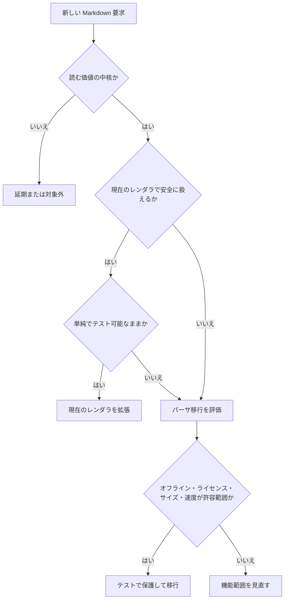

# Markdown パーサ移行基準

LocalMD Reader は現在、軽量なアプリ内 Markdown レンダラを使っています。この文書は、
現在のレンダラを拡張し続ける条件と、専用 Markdown パーサへ移行する条件を定義します。

## 判断原則

現在のレンダラが小さく、安全で、予測しやすく、高速である間は拡張を続けます。
Markdown 互換性によるユーザー価値が、現在のレンダラの単純さやサイズ上の利点を
上回ったときだけ移行を検討します。

## 現在のレンダラを拡張する場合

次のような要求は、現在のレンダラで対応します。

- 境界が明確な小さな Markdown 構文。
- エスケープ、URL フィルタ、クラッシュ耐性などの安全性修正。
- 既存出力のモバイル表示改善。
- 軽量性を保つべき Free の基本機能。
- パース処理の外側で実装できる Pro の快適化機能。

例:

- リンクの安全性改善。
- テーブル表示の改善。
- コードブロックの見た目調整。
- Mermaid ブロックの抽出。
- 目次用の見出しアンカー。

## 移行評価を開始する条件

次のうち2つ以上が当てはまる場合、専用パーサへの移行評価を開始します。

- ネストした Markdown の扱いに起因するレンダラ不具合が繰り返される。
- リスト内のコードブロック、引用、テーブル、複数段落など、CommonMark 互換の
  ネスト構造が必要になる。
- 参照リンク、脚注、定義など、文書全体をまたぐ構文が必要になる。
- 小さな修正でも広範囲のパーサ処理を触る必要が出てくる。
- レンダラのテストが、アプリ仕様ではなくパーサ互換性の再実装確認に偏ってくる。
- 現在のレンダラのサイズや複雑さが Always-Valid なモデル設計を難しくする。
- 一般的な README やプロジェクト文書を読むうえで互換性問題が目立つ。

## 即時移行を検討する条件

次の場合は、より早く移行を検討します。

- パーサ不具合により危険な HTML、危険な URL、スクリプト実行が露出しうる。
- 通常の Markdown 文書でクラッシュする不具合が繰り返される。
- Play Store やアクセシビリティ上の必須対応がパーサ正確性に依存する。
- プロジェクト文書を読むという主要価値が、一般的な Markdown 非対応で阻害される。

## パーサ候補の制約

候補となるパーサは、次の条件をすべて満たす必要があります。

- 完全にオフラインで動作する。
- `INTERNET` 権限を必要としない。
- Apache-2.0 配布と互換性のあるライセンスである。
- 軽量リーダーとして許容できるアプリサイズに収まる。
- 大きなローカルファイルでも十分高速に動作する。
- raw HTML や危険なリンクを、アプリのポリシーでエスケープまたはフィルタできる。
- 既存のレンダラ境界の背後に包める。
- Android framework に依存せずテストできる。

## 評価チェックリスト

移行前に、短い比較文書または issue コメントで次を確認します。

- パーサ名、バージョン、ソース、パッケージ、ライセンス。
- APK/AAB の増加サイズ。
- 小・中・大の Markdown サンプルでのレンダリング時間。
- raw HTML、script タグ、イベント属性、`javascript:` URL の安全性。
- ネストしたリスト、引用、テーブル、コードフェンス、参照リンク、脚注の互換性。
- JVM unit test で実行できるか。
- third-party notice とライセンスファイルが揃っているか。

## 移行手順

移行は段階的に行います。

1. 現在対応済みの Markdown について characterization test を追加する。
2. 移行理由になる互換性テストを、失敗するテストとして追加する。
3. 候補パーサ用の `MarkdownRenderer` adapter を導入する。
4. 安全性フィルタは LocalMD Reader 側の管理下に置く。
5. 既存 fixture で出力差分を比較する。
6. テストと手動確認が通るまで、内部スイッチの背後で動かす。
7. 新しい経路の方が単純で安全だと確認できてから、古い経路を削除する。

## 対象外

人気があるという理由だけでパーサを移行しません。ネットワーク読み込み、リモート
アセット、分析、広範なプラットフォーム変更を必要とするパーサは採用しません。
多くのユーザーが必要としていない互換性のために、ローカル・軽量・広告なしという
価値を損なわないようにします。
