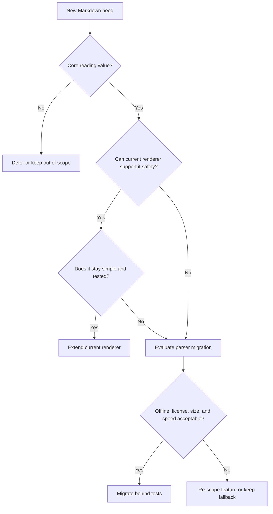

# Markdown Parser Migration Criteria

LocalMD Reader currently uses a lightweight in-app Markdown renderer. This
document defines when to keep extending that renderer and when to migrate to a
dedicated Markdown parser.

## Decision Principle

Keep the current renderer while it stays small, safe, predictable, and fast.
Migrate only when user-visible Markdown compatibility needs become more
important than the simplicity and size benefits of the current renderer.

## Keep Extending The Current Renderer

Use the current renderer when the requested behavior is one of these:

- A small Markdown construct with clear boundaries.
- A safety fix such as escaping, URL filtering, or crash resistance.
- A mobile reading improvement around existing output.
- A Free baseline feature that must stay lightweight.
- A Pro comfort feature that can be implemented outside parsing.

Examples:

- Safer links.
- Better table layout.
- Code block styling.
- Mermaid block extraction.
- Heading anchors for table of contents.

## Start A Migration Evaluation

Start evaluating a dedicated parser when two or more of these become true:

- Repeated renderer bugs come from nested Markdown parsing.
- Users need CommonMark-compatible nesting, such as lists containing code
  blocks, blockquotes, tables, or multiple paragraphs.
- The renderer needs reference links, footnotes, definitions, or other
  cross-block constructs.
- Parser logic grows enough that small fixes require broad changes.
- Renderer tests become mostly about reproducing parser behavior instead of app
  behavior.
- Current renderer size or complexity makes Always-Valid modeling harder.
- A compatibility issue affects normal project README or documentation reading.

## Immediate Migration Triggers

Migrate sooner if any of these happen:

- A parser bug can expose unsafe HTML, unsafe URL handling, or script execution.
- A renderer bug repeatedly causes crashes on ordinary Markdown documents.
- A required Play Store or accessibility issue depends on parser correctness.
- A major app value, such as project documentation reading, is blocked by
  unsupported common Markdown.

## Constraints For Parser Candidates

A parser candidate is acceptable only if it satisfies all of these constraints:

- Works fully offline.
- Does not require `INTERNET` permission.
- Has a license compatible with Apache-2.0 distribution.
- Keeps app size within the lightweight-reader goal.
- Performs well on large local files.
- Allows raw HTML and unsafe links to remain escaped or filtered by app policy.
- Can be wrapped behind the existing renderer boundary.
- Can be tested without Android framework dependencies.

## Evaluation Checklist

Before migrating, create a short comparison document or issue comment covering:

- Parser name, version, source, package, and license.
- Added APK/AAB size.
- Render time on small, medium, and large Markdown samples.
- Safety behavior for raw HTML, script tags, event attributes, and
  `javascript:` URLs.
- Compatibility behavior for nested lists, blockquotes, tables, fenced code,
  reference links, and footnotes.
- Whether the parser can run in JVM unit tests.
- Whether third-party notices and license files are complete.

## Migration Path

Migration must be incremental:

1. Add characterization tests for current supported Markdown.
2. Add failing compatibility tests that justify the migration.
3. Introduce a `MarkdownRenderer` adapter for the candidate parser.
4. Keep safety filtering under LocalMD Reader control.
5. Compare output on existing fixtures.
6. Ship behind a narrow internal switch until tests and manual checks pass.
7. Remove the old parser path only after the new path is simpler and safer.

## Non-Goals

Do not migrate only because a parser is popular. Do not add a parser that
requires network loading, remote assets, analytics, or broad platform changes.
Do not trade the app's local, lightweight, no-ads value for compatibility that
most users do not need.
