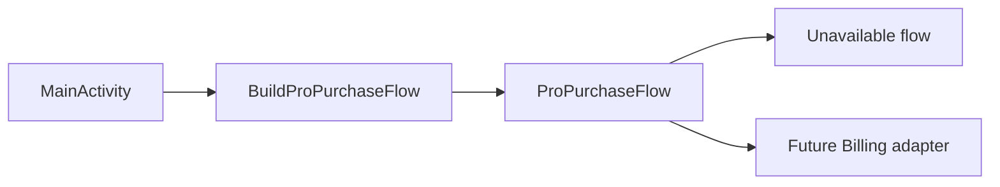
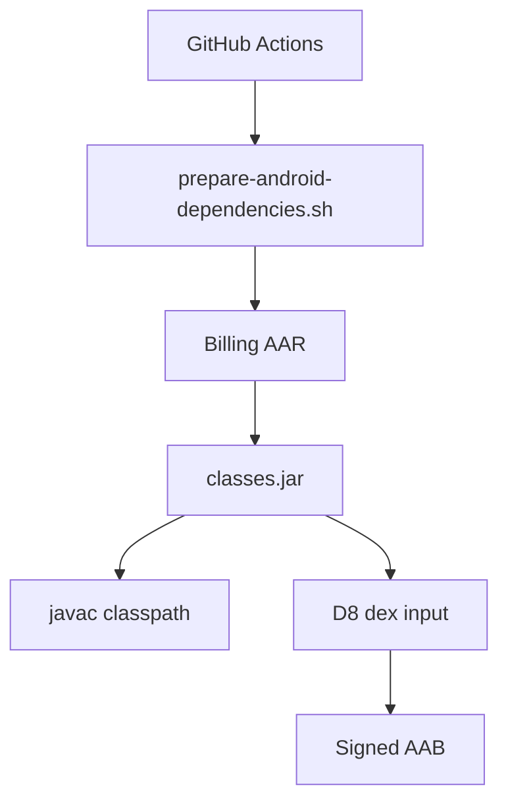

# Play Billing 設計

この文書は LocalMD Reader の初期 Pro 購入設計を定義します。

## 商品

- 商品ID: `localmd_reader_pro`
- 種別: one-time product / managed product
- 初期価格目安: 99円
- 目的: 応援購入に近い Pro 解除。便利な高度リーダー機能を提供する。

## 権利判定ルール

完了済みの購入状態だけが Pro 権利を付与します。

| 購入状態 | 権利 |
| --- | --- |
| Purchased | Pro |
| Not purchased | Free |
| Pending | Free |
| Unknown | Free |
| Billing unavailable | Free |

Unknown、通信失敗、Billing 利用不可、キャンセル、保留、信頼できない状態は、
安全側に倒して Free として扱います。

## キャッシュルール

アプリは最後に確認できた購入済み状態を、ローカル利便性のためにキャッシュしてもよいです。
ただし:

- purchase token や receipt を保存しない。
- purchase token、receipt、アカウント識別子、注文情報をログに出さない。
- キャッシュは最適化であり、真実の情報源ではない。
- Billing client が信頼できる未購入状態を返した場合は、再度 Pro をロックする。

## UI ルール

- `Pro機能` では、利用可能またはロック中の機能を表示する。
- 購入導線は `Pro機能` に置く。
- 購入成功後は、可能であればアプリ再起動なしで Pro 機能を有効化する。
- キャンセル、保留、Billing 利用不可、Unknown では Free のままにし、短い
  ユーザー向けメッセージを表示する。

## テスト戦略

次の順で実装します。

1. 購入状態モデルのテスト。
2. 商品IDと one-time product のテスト。
3. 権利変換テスト。
4. Billing adapter の状態変換テスト。
5. Google Play のライセンステスターによる実機確認。

Billing 実装は core domain の外に置きます。core domain は `ProProduct`、
`BillingPurchaseSnapshot`、`ProPurchaseState`、`ProPurchaseEntitlementSource`、
`FeatureEntitlement` だけを知ります。

## 接続境界

Activity は具体的な購入実装を直接参照しません。ビルド時点で利用可能な購入フローは
`BuildProPurchaseFlow` から取得します。

Billing 連携前のビルドでは `UnavailableProPurchaseFlow` を返し、購入ボタンを押しても
Pro 権利を付与しません。Billing adapter を追加する場合は、この境界の内側だけを
差し替えます。

## CI/CD 構成

Gradle を導入せず、既存の軽量な手書きビルドを維持します。Google Play Billing
Library は Git にコミットせず、GitHub Actions とローカルスクリプトで Google Maven
から取得します。

この構成にする理由:

- 署名鍵や外部バイナリを Git に置かない。
- ローカルと GitHub Actions で同じスクリプトを使う。
- Billing Library のバージョンを `GOOGLE_PLAY_BILLING_VERSION` で明示できる。
- Gradle 移行を先送りしつつ、Billing adapter の実装に進める。

現在は `com.android.billingclient:billing:9.0.0` を取得対象にします。公式ドキュメントも
Google Maven から `com.android.billingclient:billing:$billing_version` を追加する形を
案内しています。

`BillingPurchaseSnapshot` は Google Play Billing の状態をドメイン側で安全に扱うための
小さなスナップショットです。purchase token、receipt、order id、account id、
その他の個人情報を含めません。
