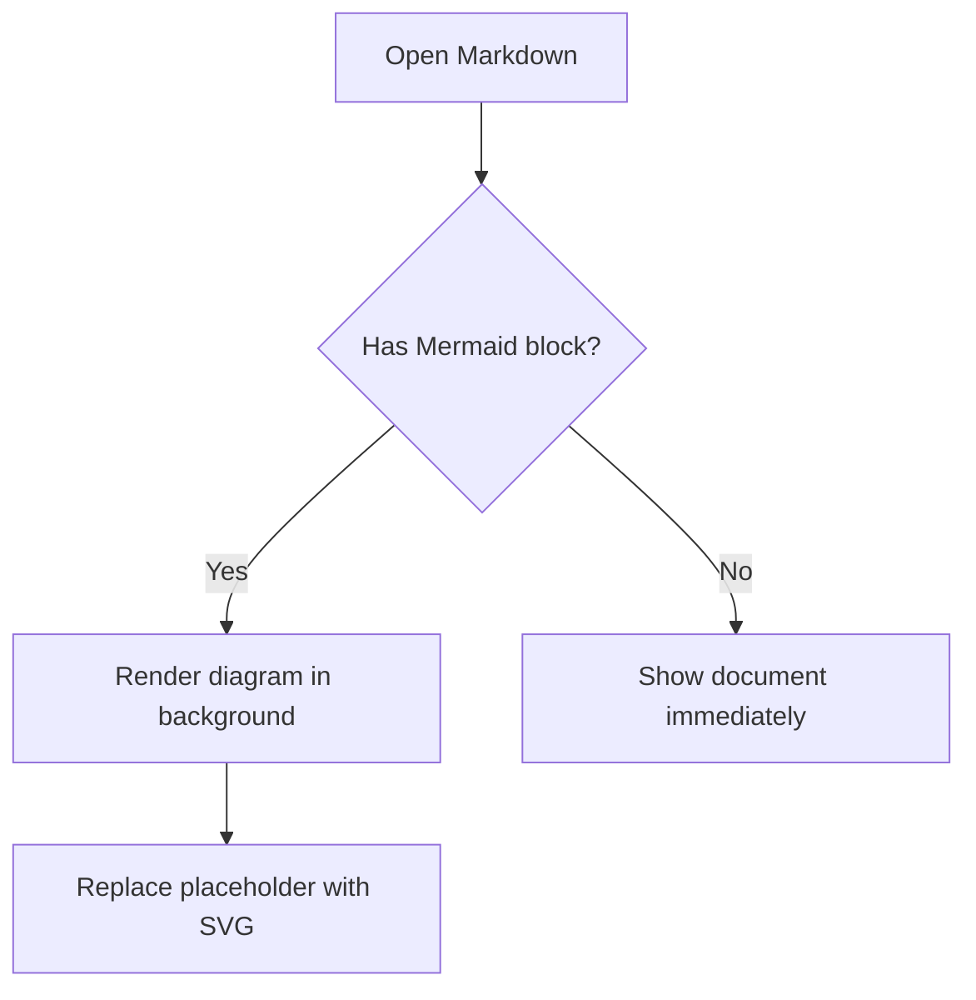
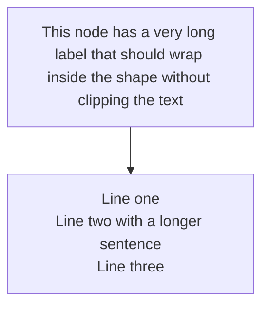
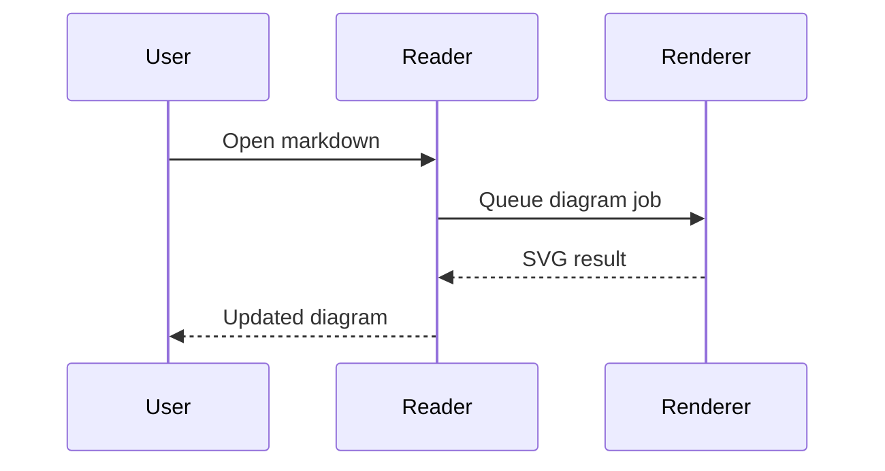

# Mermaid Rendering Demo

```mermaid
graph TD
    A[Open Markdown] --> B{Has Mermaid block?}
    B -->|Yes| C[Render diagram in background]
    B -->|No| D[Show document immediately]
    C --> E[Replace placeholder with SVG]
```

```mermaid
graph TD
    A[This node has a very long label that should wrap inside the shape without clipping the text]
    B[Line one<br/>Line two with a longer sentence<br/>Line three]
    A --> B
```

```mermaid
sequenceDiagram
    participant User
    participant Reader
    participant Renderer
    User->>Reader: Open markdown
    Reader->>Renderer: Queue diagram job
    Renderer-->>Reader: SVG result
    Reader-->>User: Updated diagram
```
