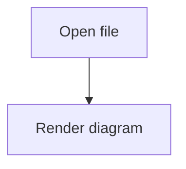

# Mermaid Error Fallback Demo

This file contains one valid diagram and two intentionally invalid Mermaid
blocks. The invalid blocks should show an error reason and the original Mermaid
source.

## Valid Diagram



## Invalid Flowchart Syntax

```mermaid
graph TD
    A[This node label never closes --> B[Next node]
```

## Unsupported Diagram Type

```mermaid
notARealMermaidDiagram
    A --> B
```
