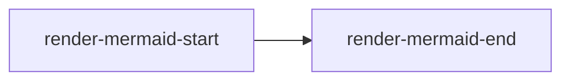

# Smoke Render Fixture

This fixture is opened by the L5 render-assert smoke to confirm that tables,
code blocks, and Mermaid diagrams render without crashing and produce visible
text that UIAutomator can assert against.

## Table

| Item | Value |
| --- | --- |
| render-table-alpha | visible |
| render-table-beta | visible |

## Code Block

```kotlin
// render-code-block-check
val result = "renders"
```

## Code Preview

```Markdown source=render-markdown-info
# render-markdown-preview-heading
```

```HTML title="render-html-info"
<h1 class="render-html-preview-heading" onclick="alert(1)">render-html-preview-heading</h1>
```

## Mermaid


